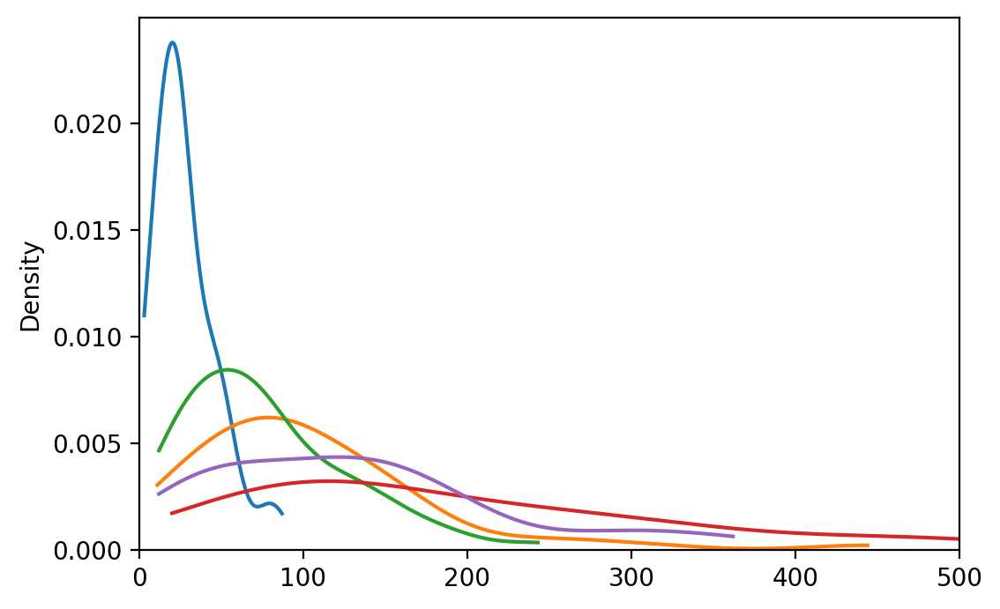
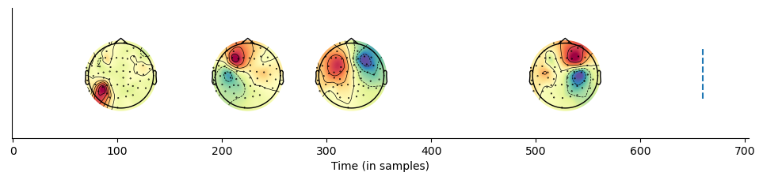
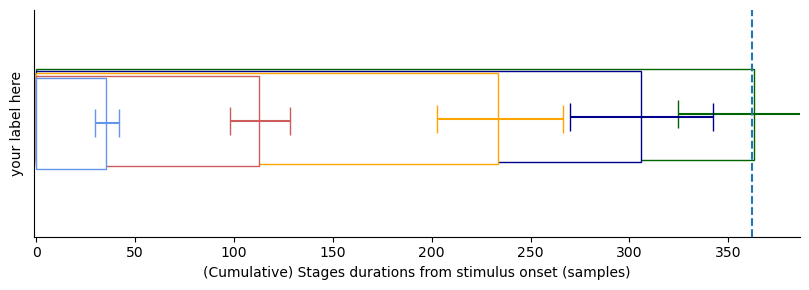
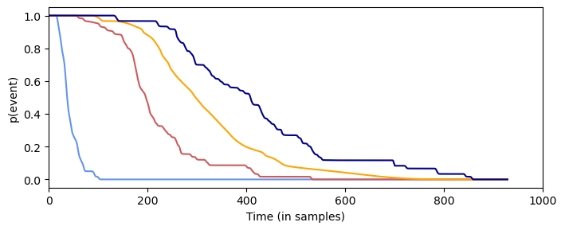
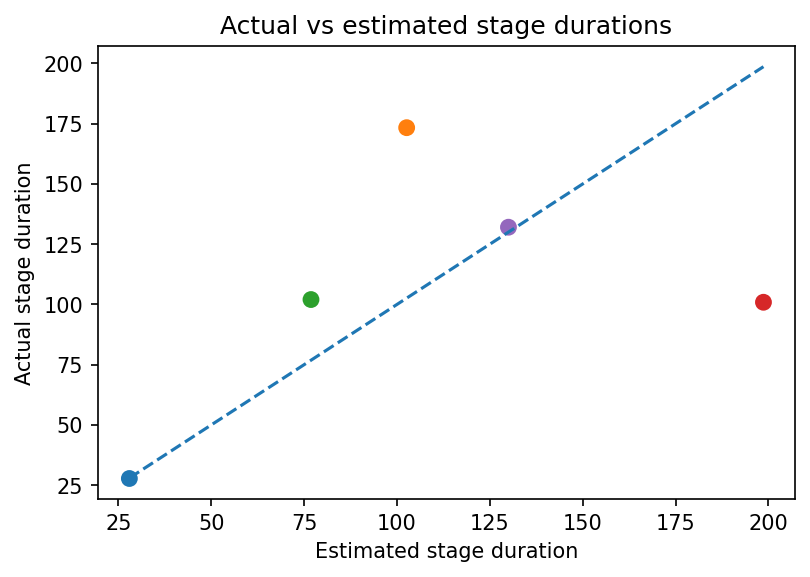
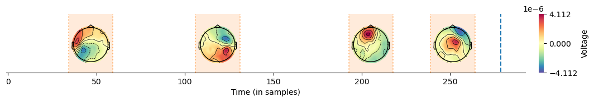
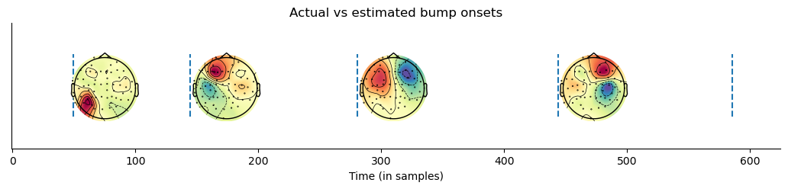
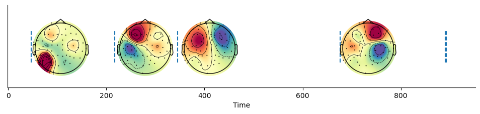
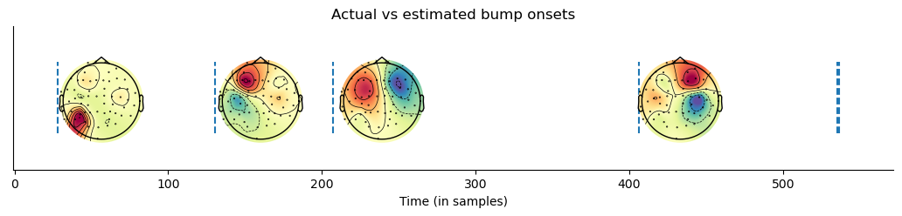
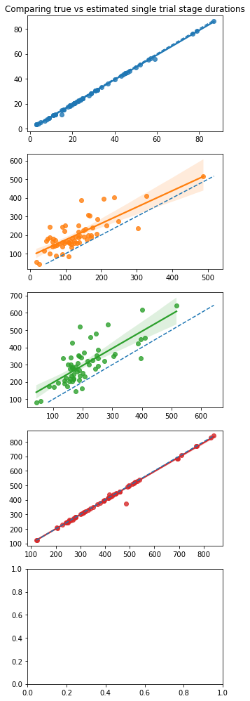

pyHSMM-MVPA
==========

`pyHSMM-MVPA`_ is an open-source Python package to estimate Hidden Semi-Markov Models in a Multivariate Pattern Analysis of electro-encephalographic data based on the method developed by Anderson, Zhang, Borst, & Walsh  ( [2016](https://psycnet.apa.org/doi/10.1037/rev0000030) ) and Borst & Anderson ( [2021](http://jelmerborst.nl/pubs/ACTR_HsMM_MVPA_BorstAnderson_preprint.pdf) )


# Documentation

The package will be soon available through *pip*, in the meantime, to install pyhsmm-mvpa you can clone the repository using *git*

Open a terminal and type:

    $ git clone https://github.com/gweindel/pyhsmm-mvpa.git
   
Then install the required dependencies:

- Python >= 3.7
- NumPy >= 1.18.1
- MNE >= 1.0
- Matplotlib >= 3.1.0
- xarray >= 2022.6.0

A recommended way of installing these dependency is to use a new conda environment (see `anaconda <https://www.anaconda.com/products/distribution>`__ for how to install conda):

.. code-block:: console

    $ conda create -n pyhsmm xarray mne 
    $ conda activate pyhsmm

Then naviguate to the cloned repository and import pyhsmm-mvpa in your favorite python IDE through:

.. code-block:: python

    import pyhsmm_mvpa as hsmm


## Demo on simulated data

### Importing libraries


```python
import numpy as np
import matplotlib.pyplot as plt
import xarray as xr
import seaborn as sns
from mne import channels

## Importing 
import pyhsmm_mvpa as hsmm
from pyhsmm_mvpa import simulations
```

### Simulating data


```python
cpus = 16 # For multiprocessing
path = 'simulated/'

n_events = 60 #Number of trials to simulate

sources = [['lateraloccipital-lh',1e-2, [np.random.gamma,2,15]],#One source = localization, acitvation amplitude and onset latencies
           ['postcentral-lh', 1e-2, [np.random.gamma, 2, 50]],
           ['posteriorcingulate-rh', 1e-2, [np.random.gamma, 2,40]],
           ['postcentral-rh', 1e-2, [np.random.gamma, 2,100]],
           ['postcentral-lh', 1e-10, [np.random.gamma, 2,75]]]#Equivalent to a response trigger as amplitude make it hardly visible

max_trial_length = 3000#length of a trial (ISI)

bump_frequency = 10.#Frequency of the simulated bumps
file = 'dataset_tutorial'
mne_path = path+file+'_raw.fif'

raw, generating_events = simulations.simulate(sources, n_events, max_trial_length, cpus, bump_frequency, file, path, overwrite=True)
```

    Aligning file name to MNE's convention
    Simulating dataset_tutorial_raw.fif in simulated/
    Overwriting existing file.
    Writing /home/gweindel/owncloud/projects/RUGUU/pyhsmm-mvpa/simulated/dataset_tutorial_raw.fif
    Closing /home/gweindel/owncloud/projects/RUGUU/pyhsmm-mvpa/simulated/dataset_tutorial_raw.fif
    [done]
    simulated/dataset_tutorial_raw.fif simulated


### Creating the event structure and plotting the raw data


```python
resp_trigger = int(np.max(np.unique(generating_events[:,2])))#Resp trigger is the last source in each trial
event_id = {'stimulus':0}
resp_id = {'response':resp_trigger}
events = generating_events[(generating_events[:,2] == 0) | (generating_events[:,2] == resp_trigger)]
```

### Recovering number of sources as well as actual by-trial variation


```python
%matplotlib inline
number_of_sources = len(np.unique(generating_events[:,2])[1:])#one trigger = one source
random_source_times = np.zeros((int(len(generating_events)/(number_of_sources+1)), number_of_sources))

i,x = 1,0                  
while x < len(random_source_times):
    for j in np.arange(number_of_sources):#recovering the individual duration- of bump onset
        random_source_times[x,j] = generating_events[i,0] - generating_events[i-1,0]
        i += 1
    i += 1
    x += 1

plt.figure(dpi=200)
for source in random_source_times.T:#plotting these source durations
    sns.kdeplot(source, cut=0)
plt.xlim(0,500)
plt.show()
```
    

    


## Demo of the HsMM Code for a single participant in a single condition based on the simulated data


```python
# Reading the data
eeg_dat = hsmm.utils.read_mne_EEG(mne_path, event_id, resp_id, raw.info['sfreq'],events, verbose=False)

```

    Processing participant simulated/dataset_tutorial_raw.fif
    Reading 0 ... 194999  =      0.000 ...   324.666 secs...
    N trials without response event: 0
    Applying reaction time trim to keep RTs between 0.001 and 5 seconds
    60 trials were retained for participant simulated/dataset_tutorial_raw.fif


```python
raw.info['sfreq']
```


    600.614990234375


```python
#example of usage of xarray
eeg_dat.sel(epochs=0,electrodes=['EEG 001','EEG 002','EEG 003']).plot.scatter(x='samples', y='data',hue='electrodes')
```

    

    


```python
hsmm_dat, PCs, explained_var, means = hsmm.utils.transform_data(eeg_dat.data,'',
        apply_standard=False, single=True, n_comp=4)

hsmm_dat = hsmm.utils.stack_data(hsmm_dat,'',single=True)
```


```python
hsmm_dat
```


</style><pre class='xr-text-repr-fallback'>&lt;xarray.Dataset&gt;
Dimensions:      (component: 4, all_samples: 32168, participant: 1, trial: 60)
Coordinates:
  * component    (component) int64 0 1 2 3
  * all_samples  (all_samples) object MultiIndex
  * epochs       (all_samples) int64 0 0 0 0 0 0 0 0 ... 59 59 59 59 59 59 59 59
  * samples      (all_samples) int64 0 1 2 3 4 5 6 ... 368 369 370 371 372 373
  * trial        (trial) int64 0 1 2 3 4 5 6 7 8 ... 51 52 53 54 55 56 57 58 59
Dimensions without coordinates: participant
Data variables:
    data         (participant, component, all_samples) float64 -0.2186 ... -0...
    starts       (trial) int64 0 774 1413 2022 2638 ... 30296 30930 31331 31794
    ends         (trial) int64 773 1412 2021 2637 ... 30929 31330 31793 32167</pre>

# Estimating a 4 bump model


```python
init = hsmm.models.hsmm(hsmm_dat.data.T[:,:,0], hsmm_dat.starts.data, 
                 hsmm_dat.ends.data, sf=eeg_dat.sfreq, bump_width=50, cpus=16)

estimates = init.fit_single(number_of_sources-1)
```

    Estimating parameters for 4 bumps model
    Parameters estimated for 4 bumps model


### Visualizing results of the fit


```python
selected = estimates
bump_times_selected = init.bump_times(selected.eventprobs)
mean_bump_times_selected = np.mean(bump_times_selected, axis=0)

positions = np.delete(channels.layout._find_topomap_coords(raw.info, 'eeg'),52,axis=0)#inferring electrode location
electrodes_selected = hsmm.utils.reconstruct(selected.magnitudes, PCs, explained_var, means)
```


```python
hsmm.visu.plot_topo_timecourse(electrodes_selected, mean_bump_times_selected, positions, 
                               bump_size=init.bump_width_samples, magnify=5, figsize=(12,2),
                                time_step = 1,  times_to_display = np.mean(init.ends - init.starts))
```


    

    


```python
ax = hsmm.visu.plot_latencies_average(bump_times_selected, init.bump_width_samples, 1, errs='std', times_to_display = np.mean(init.ends - init.starts))
ax.set_ylabel('your label here');
```


    

    


```python
hsmm.visu.plot_latencies_gamma(selected.parameters.dropna('stage').values, init.bump_width_samples,  times_to_display = np.mean(init.ends - init.starts));
```


    

    


```python
hsmm.visu.plot_distribution(selected.eventprobs.mean(dim=['trial']), xlims=(0,1000))
hsmm.visu.plot_distribution(selected.eventprobs.mean(dim=['trial']), xlims=(0,1000), survival=True);
```


    

    


    

    


## Comparing with ground truth


```python
plt.figure(dpi=150)
colors = sns.color_palette(None, number_of_sources)#['darkblue','indianred','darkgreen','red','purple','grey']
#print(np.mean(random_source_times, axis=0)- (estimates.parameters.dropna('stage').isel(params=1)*2+np.concatenate([[0],np.repeat(init.bump_width_samples,number_of_sources-1)])))
plt.scatter(np.mean(random_source_times, axis=0), estimates.parameters.dropna('stage').isel(params=1)*2+np.concatenate([[0],np.repeat(init.bump_width_samples,number_of_sources-1)]), color=colors,s=50)
plt.plot([np.min(np.mean(random_source_times,axis=0)),np.max(np.mean(random_source_times,axis=0))],
         [np.min(np.mean(random_source_times,axis=0)),np.max(np.mean(random_source_times,axis=0))],'--');
plt.title('Actual vs estimated stage durations')
plt.xlabel('Estimated stage duration')
plt.ylabel('Actual stage duration')
plt.show()

```


    

    


```python
positions = np.delete(channels.layout._find_topomap_coords(raw.info, 'eeg'),52,axis=0)#inferring electrode location
electrodes = hsmm.utils.reconstruct(estimates.magnitudes, PCs, explained_var, means)

hsmm.visu.plot_topo_timecourse(electrodes, np.mean(init.bump_times(estimates.eventprobs), axis=0), positions,#inferring electrode location, 
        bump_size=init.bump_width_samples, time_step = 1, magnify=4, figsize=(13,2), title='Actual vs estimated bump onsets',
        times_to_display = np.mean(np.cumsum(random_source_times,axis=1),axis=0))
```


    

    


```python

fig, ax= plt.subplots(number_of_sources-1,1, figsize=(5,3.5*number_of_sources))
ax[0].set_title('Comparing true vs estimated single trial stage durations')
i = 0
gen_bump_location = np.cumsum(random_source_times[:,:-1], axis=1)
for bump in init.bump_times(estimates.eventprobs)[:,:number_of_sources-1].T:
    sns.regplot(x=gen_bump_location[:,i].T, y=bump, ax=ax[i], color=colors[i])
    ax[i].plot([np.min(bump), np.max(bump)], [np.min(bump), np.max(bump)],'--')
    i+= 1
```


    

    


# N_bump selection: iterative backward estimates


```python
bests = init.backward_estimation()

bests
```

    Estimating all solutions for maximal number of bumps (7) with 0 random starting points
    Estimating parameters for 7 bumps model
    Parameters estimated for 7 bumps model

</style><pre class='xr-text-repr-fallback'>&lt;xarray.Dataset&gt;
Dimensions:      (n_bumps: 7, stage: 8, params: 2, component: 4, bump: 7,
                  samples: 929, trial: 60)
Coordinates:
  * n_bumps      (n_bumps) int64 7 6 5 4 3 2 1
Dimensions without coordinates: stage, params, component, bump, samples, trial
Data variables:
    likelihoods  (n_bumps) float64 1.711e+03 1.995e+03 ... 1.166e+03 406.9
    parameters   (n_bumps, stage, params) float64 2.0 13.18 2.0 ... nan nan nan
    magnitudes   (n_bumps, component, bump) float64 -1.026 4.417 ... nan nan
    eventprobs   (n_bumps, samples, trial, bump) float64 0.0 0.0 0.0 ... nan nan</pre>

```python
plt.plot(np.arange(init.max_bumps,0,-1), bests.likelihoods,'o-')
plt.ylabel('Log-likelihood')
plt.xlabel('N-bump model')
plt.show()
```


    

    


```python
electrodes = hsmm.utils.reconstruct(bests.magnitudes, PCs, explained_var, means)

hsmm.visu.plot_topo_timecourse(electrodes, [np.mean(init.bump_times(x),axis=0) for x in bests.eventprobs], positions,
    bump_size=init.bump_width_samples, time_step = 1000/init.sf,  magnify=3, times_to_display = np.mean(np.cumsum(random_source_times,axis=1),axis=0),
    figsize=(15,10), ylabels={'Number of bumps':np.arange(init.max_bumps,0,-1)})
```


    

    


```python
selected = bests.sel(n_bumps=4)
bump_times_selected = init.bump_times(selected.eventprobs.dropna('bump'))
mean_bump_times_selected = np.mean(bump_times_selected, axis=0)
electrodes_selected = xr.DataArray(hsmm.utils.reconstruct(selected.magnitudes,PCs, explained_var, means))
```


```python
hsmm.visu.plot_topo_timecourse(electrodes_selected, mean_bump_times_selected, positions, 
                               bump_size=init.bump_width_samples, magnify=5, figsize=(12,2),
                                time_step = 1000/init.sf,  times_to_display = np.concatenate([np.mean(np.cumsum(random_source_times,axis=1),axis=0),[np.mean(hsmm_dat.ends.data - hsmm_dat.starts.data)]]),
                                ylabels='5 bumps model', vmin=-10, vmax=10)
```


    

    


```python
plt.figure(dpi=150)
colors = sns.color_palette(None, number_of_sources)#['darkblue','indianred','darkgreen','red','purple','grey']
#print(np.mean(random_source_times, axis=0)- (estimates.parameters.dropna('stage').isel(params=1)*2+np.concatenate([[0],np.repeat(init.bump_width_samples,number_of_sources-1)])))
plt.scatter(np.mean(random_source_times, axis=0), selected.parameters.dropna('stage').isel(params=1)*2+np.concatenate([[0],np.repeat(init.bump_width_samples,number_of_sources-1)]), color=colors,s=50)
plt.plot([np.min(np.mean(random_source_times,axis=0)),np.max(np.mean(random_source_times,axis=0))],
         [np.min(np.mean(random_source_times,axis=0)),np.max(np.mean(random_source_times,axis=0))],'--');
plt.title('Actual vs estimated stage durations')
plt.xlabel('Estimated stage duration')
plt.ylabel('Actual stage duration')
plt.show()

positions = np.delete(channels.layout._find_topomap_coords(raw.info, 'eeg'),52,axis=0)#inferring electrode location
electrodes = hsmm.utils.reconstruct(selected.magnitudes, PCs, explained_var, means)

hsmm.visu.plot_topo_timecourse(electrodes, np.mean(init.bump_times(selected.eventprobs), axis=0), positions,#inferring electrode location, 
        bump_size=init.bump_width_samples, time_step = 1, magnify=4, figsize=(13,2), title='Actual vs estimated bump onsets',
        times_to_display = np.concatenate([np.mean(np.cumsum(random_source_times,axis=1),axis=0),[np.mean(hsmm_dat.ends.data - hsmm_dat.starts.data)]]))

fig, ax= plt.subplots(5,1, figsize=(5,3.5*number_of_sources))
ax[0].set_title('Comparing true vs estimated single trial stage durations')
i = 0
gen_bump_location = np.cumsum(random_source_times[:,:-1], axis=1)
for bump in init.bump_times(estimates.eventprobs)[:,:number_of_sources-1].T:
    sns.regplot(x=gen_bump_location[:,i].T, y=bump, ax=ax[i], color=colors[i])
    ax[i].plot([np.min(bump), np.max(bump)], [np.min(bump), np.max(bump)],'--')
    i+= 1
```


    

    


    

    


    

    

