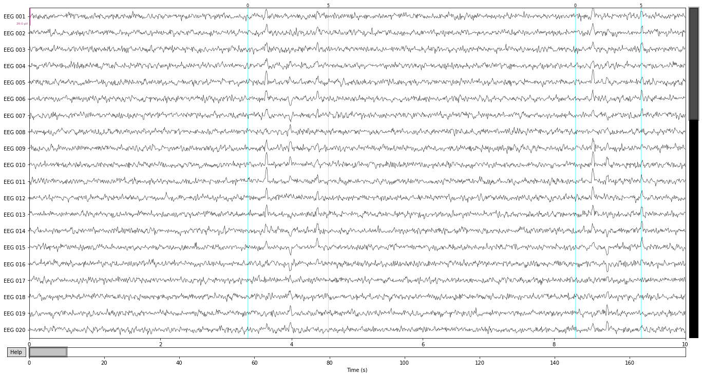
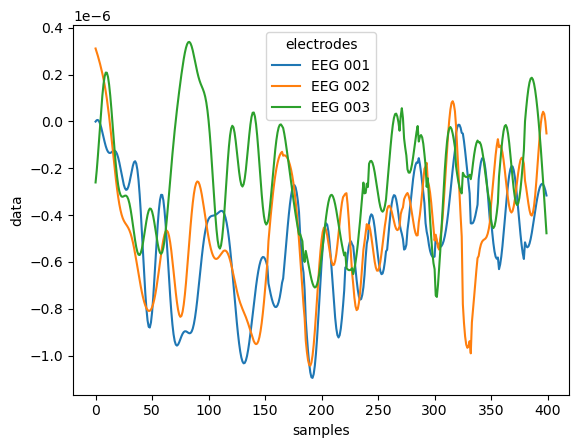
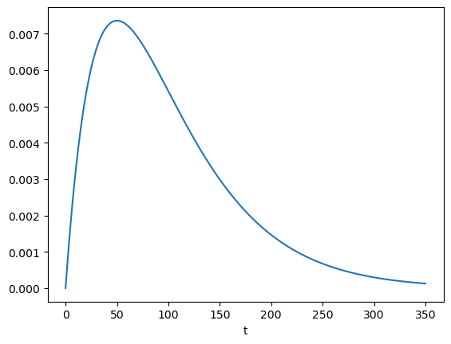
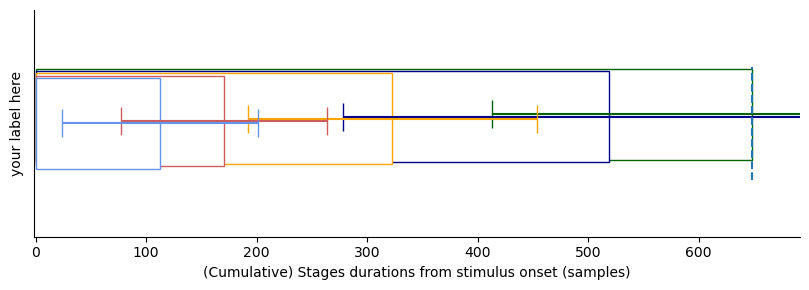
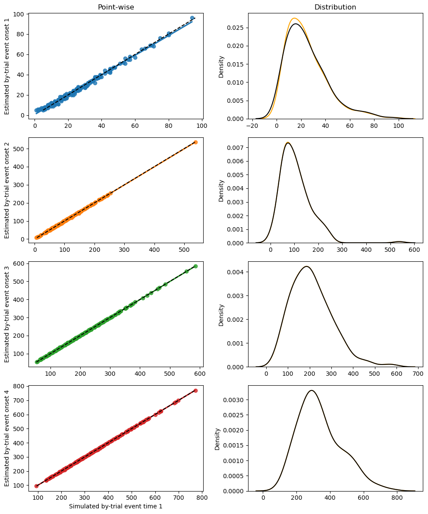
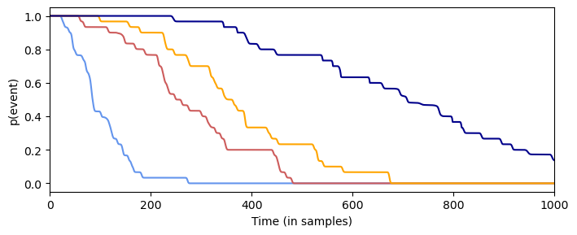
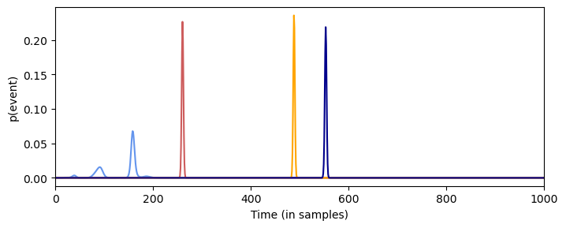
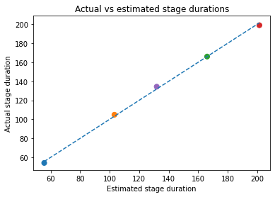
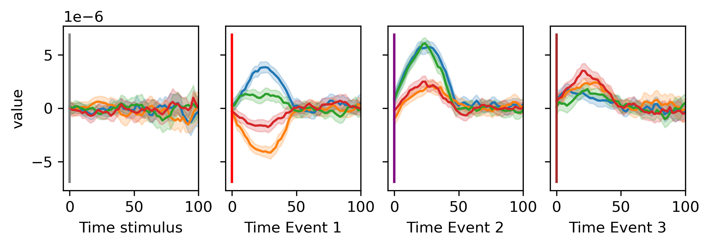
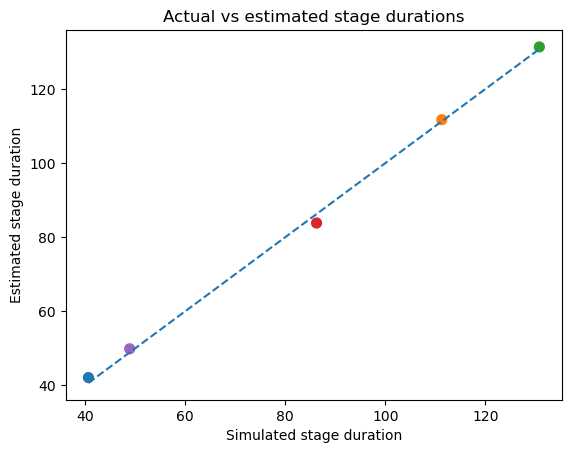

HsMM-MVpy
==========

hsmm_mvpy is an open-source Python package to estimate Hidden Semi-Markov Models in a Multivariate Pattern Analysis (HsMM-MVPA) of electro-encephalographic (EEG) data based on the method developed by Anderson, Zhang, Borst, & Walsh  ([2016](https://psycnet.apa.org/doi/10.1037/rev0000030)) and Borst & Anderson ([2021](http://jelmerborst.nl/pubs/ACTR_HsMM_MVPA_BorstAnderson_preprint.pdf))


# Documentation

The package is available through *pip* with the command ```pip install hsmm_mvpy```. 
A recommended way of using the package is to use a conda environment (see [anaconda](https://www.anaconda.com/products/distribution>) for how to install conda):

    $ conda create -n hsmm 
    $ conda activate hsmm
    $ pip install hsmm_mvpy

Then import pyhsmm-mvpa in your favorite python IDE through:

```python
    import hsmm_mvpy as hsmm
```

For the cutting edge version (not recommended) you can clone the repository using *git*

Open a terminal and type:

    $ git clone https://github.com/gweindel/hsmm_mvpy.git
   
Then move to the clone repository and run 
    
    $ pip install -e .

## To get started
To get started with the code:
- Check the demo below 
- Inspect the tutorials in the tutorials repository
    - Load EEG data (tutorial 1)
    - Estimating a given number of bumps (tutorial 2)
    - Test for the number of bumps that best explains the data (tutorial 3)
    - Testing differences across conditions (tutorial 4)

To get started or further learn about the method be sure to check the paper by Anderson, Zhang, Borst, & Walsh  ([2016](https://psycnet.apa.org/doi/10.1037/rev0000030)) as well as the book chapter by Borst & Anderson ([2021](http://jelmerborst.nl/pubs/ACTR_HsMM_MVPA_BorstAnderson_preprint.pdf)). The following list also contains a non-exhaustive list of papers published with HsMM-MVPA:
- Berberyan, H. S., van Maanen, L., van Rijn, H., & Borst, J. (2021). EEG-based identification of evidence accumulation stages in decision-making. Journal of Cognitive Neuroscience, 33(3), 510-527. [link](https://doi.org/10.1162/jocn_a_01663)
- Van Maanen, L., Portoles, O., & Borst, J. P. (2021). The discovery and interpretation of evidence accumulation stages. Computational brain & behavior, 4(4), 395-415. [link](https://link.springer.com/article/10.1007/s42113-021-00105-2)
- Portoles, O., Blesa, M., van Vugt, M., Cao, M., & Borst, J. P. (2022). Thalamic bursts modulate cortical synchrony locally to switch between states of global functional connectivity in a cognitive task. PLoS computational biology, 18(3), e1009407. [link](https://journals.plos.org/ploscompbiol/article?id=10.1371/journal.pcbi.1009407)

## Demo on simulated data

The following section will quickly walk you through an example usage in simulated data


First we load the libraries necessary for the demo on simulated data

### Importing libraries


```python
import numpy as np
import matplotlib.pyplot as plt
import xarray as xr
import seaborn as sns
from mne import channels

## Importing 
import hsmm_mvpy as hsmm
from hsmm_mvpy import simulations
```

### Simulating data

In the following code block we simulate 30 trials from four known sources, this is not code you would need for your own analysis except if you want to simulate and test properties of HsM models. All these four sources are defined by a localization, an activation amplitude and a distribution (here gamma wuth shape and scale parameters) for the onsets of the bumps on each trial. The simulation functions are based on the [MNE tutorial ](https://mne.tools/stable/auto_examples/simulation/simulated_raw_data_using_subject_anatomy.html).


```python
cpus = 16 # For multiprocessing, usually a good idea to use multiple CPus as long as you have enough RAM
path = 'simulated/'#Wehre simulated data will go, vreate that folder if you don't have it where you're executing the code

n_events = 30 #Number of trials to simulate

sources = [['lateraloccipital-lh',5e-9, [np.random.gamma,2,30]],#One source = localization, acitvation amplitude and onset latencies
           ['postcentral-lh', 5e-9, [np.random.gamma, 2, 50]],
           ['posteriorcingulate-rh', 5e-9, [np.random.gamma, 2,80]],
           ['postcentral-rh', 5e-9, [np.random.gamma, 2,110]],
           ['postcentral-lh', 1e-20, [np.random.gamma, 2,65]]] #Equivalent to a response trigger as amplitude make it hardly visible

max_trial_length = 3000 #length of a trial (ISI)

bump_frequency = 10. #Frequency of the simulated bumps
file = 'dataset_tutorial' #Name of the file to save
mne_path = path+file+'_raw.fif'

raw, generating_events = simulations.simulate(sources, n_events, max_trial_length, cpus, bump_frequency, file, path, overwrite=True)
```

    Aligning file name to MNE's convention
    Simulating dataset_tutorial_raw.fif in simulated/
    Overwriting existing file.
    Writing /home/gweindel/owncloud/projects/RUGUU/hsmm-mvpy/simulated/dataset_tutorial_raw.fif
    Closing /home/gweindel/owncloud/projects/RUGUU/hsmm-mvpy/simulated/dataset_tutorial_raw.fif
    [done]
    simulated/dataset_tutorial_raw.fif simulated


### Creating the event structure and plotting the raw data


To recover the data we need to create the event structure based on the triggers sent during simulation. This is the same as analyzing real EEG data and recovering events in the stimulus channel. In our case 0 signal the onset of the stimulus and 5 the onset of the response. Hence a trial is defined as the times occuring between the triggers 0 and 5.


```python
resp_trigger = int(np.max(np.unique(generating_events[:,2])))#Resp trigger is the last source in each trial
event_id = {'stimulus':0}
resp_id = {'response':resp_trigger}
events = generating_events[(generating_events[:,2] == 0) | (generating_events[:,2] == resp_trigger)]#only retain stimulus and response triggers

raw.copy().pick_types(eeg=True).plot(scalings=dict(eeg=1e-5), events=events);
```

    Removing projector <Projection | PCA-v1, active : True, n_channels : 102>
    Removing projector <Projection | PCA-v2, active : True, n_channels : 102>
    Removing projector <Projection | PCA-v3, active : True, n_channels : 102>
    Using matplotlib as 2D backend.
    Opening raw-browser...


    

    


### Recovering number of sources as well as actual by-trial variation

To compare the by-trial duration of bumps that we will estimate later on we first recover the actual number of sources used in the simulation as well as the actual by-trial variation in the onset of the bumps.


```python
%matplotlib inline
number_of_sources = len(np.unique(generating_events[:,2])[1:])#one trigger = one source
random_source_times = np.zeros((int(len(generating_events)/(number_of_sources+1)), number_of_sources))

i,x = 1,0                  
while x < len(random_source_times):
    for j in np.arange(number_of_sources):#recovering the individual duration- of bump onset
        random_source_times[x,j] = generating_events[i,0] - generating_events[i-1,0]
        i += 1
    i += 1
    x += 1
```

## Demo of the HsMM Code for a single participant in a single condition based on the simulated data

First we read the EEG data as we would for a single participant:


```python
# Reading the data
eeg_dat = hsmm.utils.read_mne_EEG(mne_path, event_id, resp_id, raw.info['sfreq'], events_provided=events, verbose=False)

```

    Processing participant simulated/dataset_tutorial_raw.fif
    Reading 0 ... 104999  =      0.000 ...   174.819 secs...
    N trials without response event: 0
    Applying reaction time trim to keep RTs between 0.001 and 5 seconds
    30 RTs kept of 30 clean epochs
    30 trials were retained for participant simulated/dataset_tutorial_raw.fif
    End sampling frequency is 600.614990234375 Hz


The package uses [xarray](https://docs.xarray.dev/en/stable/) named dimension matrices, allowing to directly manipulate the data using the name of the dimensions:


```python
#example of usage of xarray
print(eeg_dat)
eeg_dat.sel(epochs=0,electrodes=['EEG 001','EEG 002','EEG 003']).plot.scatter(x='samples', y='data',hue='electrodes');
```

    <xarray.Dataset>
    Dimensions:      (participant: 1, epochs: 30, electrodes: 59, samples: 1365)
    Coordinates:
      * epochs       (epochs) int64 0 1 2 3 4 5 6 7 8 ... 21 22 23 24 25 26 27 28 29
      * electrodes   (electrodes) <U7 'EEG 001' 'EEG 002' ... 'EEG 059' 'EEG 060'
      * samples      (samples) int64 0 1 2 3 4 5 6 ... 1359 1360 1361 1362 1363 1364
      * participant  (participant) <U2 'S0'
    Data variables:
        data         (participant, epochs, electrodes, samples) float64 -1.045e-0...
        event        (participant, epochs) <U8 'stimulus' 'stimulus' ... 'stimulus'
    Attributes:
        sfreq:    600.614990234375


    

    


Next we transform the data as in Anderson, Zhang, Borst, & Walsh  ([2016](https://psycnet.apa.org/doi/10.1037/rev0000030)) including standardization of individual variances (not in this case as we have only one simulated participant), z-scoring and spatial principal components analysis (PCA). 

Note that if the number of components to retain is not specified, the scree plot of the PCA is displayed and a prompt ask how many PCs should be retained 


```python
hsmm_dat = hsmm.utils.transform_data(eeg_dat.data, apply_standard=False, single=True, n_comp=10)

hsmm_dat = hsmm.utils.stack_data(hsmm_dat)
```

# Estimating an HsMM model

We know that we generate from four sources so let's just try to recover those four sources by directly estimating a 4 bump model. 


```python
init = hsmm.models.hsmm(hsmm_dat, sf=eeg_dat.sfreq, bump_width=50, cpus=16)#Initialization of the model

selected = init.fit_single(number_of_sources-1, starting_points=25)#function to fit an instance of a 4 bumps model with 25 random starting points for the expectation maximization algorithm
```

    Estimating parameters for 4 bumps model with 24 random starting points
    Parameters estimated for 4 bumps model


### Visualizing results of the fit


```python
bump_times_selected = init.bump_times(selected.eventprobs)#computing predicted bump times

positions = np.delete(channels.layout._find_topomap_coords(raw.info, 'eeg'),52,axis=0)#inferring electrode location
electrodes_selected = init.compute_topo(eeg_dat, selected.eventprobs)#Computing electrode activity at bump location
```

We can directly take a look to the topologies and latencies of the bumps by calling ```hsmm.visu.plot_topo_timecourse```


```python
hsmm.visu.plot_topo_timecourse(electrodes_selected, bump_times_selected, positions, 
                               bump_size=init.bump_width_samples, magnify=5, figsize=(12,2),
                                time_step = 1,  times_to_display = np.mean(init.ends - init.starts))
```


    

    


And take a closer look to stages and their by-trial variation


```python
bump_times_selected = init.bump_times(selected.eventprobs, mean=False)#computing predicted bump times

ax = hsmm.visu.plot_latencies_average(bump_times_selected, init.bump_width_samples, 1, errs='std', times_to_display = np.mean(init.ends - init.starts))
ax.set_ylabel('your label here');
```


    

    


And inspect the probability distribution of bump onsets:


```python
hsmm.visu.plot_distribution(selected.eventprobs.mean(dim=['trial_x_participant']), xlims=(0,1000))
hsmm.visu.plot_distribution(selected.eventprobs.mean(dim=['trial_x_participant']), xlims=(0,1000), survival=True);
```


    

    


    

    


As HsMM-MVPA selected those bumps onset per trial we can also look at the predicted bump onsets for a single trial


```python
hsmm.visu.plot_distribution(selected.eventprobs.sel(trial_x_participant=('S0', 0)), xlims=(0,1000))
```


    <AxesSubplot:xlabel='Time (in samples)', ylabel='p(event)'>


    

    


## Comparing with ground truth

Now as we simulated the data we have access to the ground truth of the underlying generative events. We can then compare the average stage durations compared to the one estimated by HsMM-MVPA


```python
colors = sns.color_palette(None, number_of_sources)
plt.scatter(np.mean(random_source_times, axis=0), selected.parameters.dropna('stage').isel(params=1)*2+np.concatenate([[0],np.repeat(init.bump_width_samples,number_of_sources-1)]), color=colors,s=50)
plt.plot([np.min(np.mean(random_source_times,axis=0)),np.max(np.mean(random_source_times,axis=0))],
         [np.min(np.mean(random_source_times,axis=0)),np.max(np.mean(random_source_times,axis=0))],'--');
plt.title('Actual vs estimated stage durations')
plt.xlabel('Estimated stage duration')
plt.ylabel('Actual stage duration')
plt.show()

```


    

    


Or also overlay actual bumps onset with predicted one


```python
positions = np.delete(channels.layout._find_topomap_coords(raw.info, 'eeg'),52,axis=0)#inferring electrode location
electrodes = init.compute_topo(eeg_dat, selected.eventprobs)#Computing electrode activity at bump location

hsmm.visu.plot_topo_timecourse(electrodes, init.bump_times(selected.eventprobs), positions,#inferring electrode location, 
        bump_size=init.bump_width_samples, time_step = 1, magnify=4, figsize=(13,2), title='Actual vs estimated bump onsets',
        times_to_display = np.mean(np.cumsum(random_source_times,axis=1),axis=0))
```


    

    


And even compare single trial onsets with those estimated from the HsMM model


```python
fig, ax= plt.subplots(number_of_sources-1,1, figsize=(5,3.5*number_of_sources))
ax[0].set_title('Comparing true vs estimated single trial stage durations')
i = 0
gen_bump_location = np.cumsum(random_source_times[:,:-1], axis=1)
for bump in init.bump_times(selected.eventprobs, mean=False)[:,:number_of_sources-1].T:
    sns.regplot(x=gen_bump_location[:,i].T, y=bump, ax=ax[i], color=colors[i])
    ax[i].plot([np.min(bump), np.max(bump)], [np.min(bump), np.max(bump)],'--')
    ax[i].set_ylabel(f'Estimated by-trial stage duration for stage {i+1}')
    ax[i].set_xlabel(f'Simulated by-trial stage duration for stage {i+1}')
    i+= 1
```


    

    


For examples on how to use the package when the number of bumps are unkown, or to compare stage durations across conditions see the tutorial notebooks
