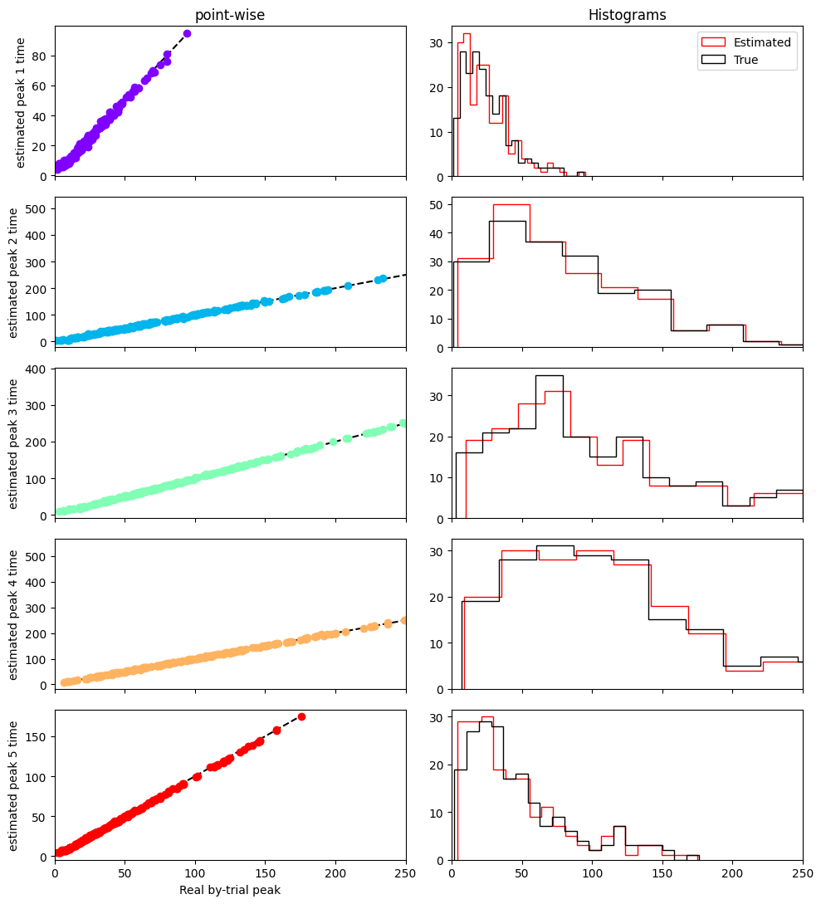
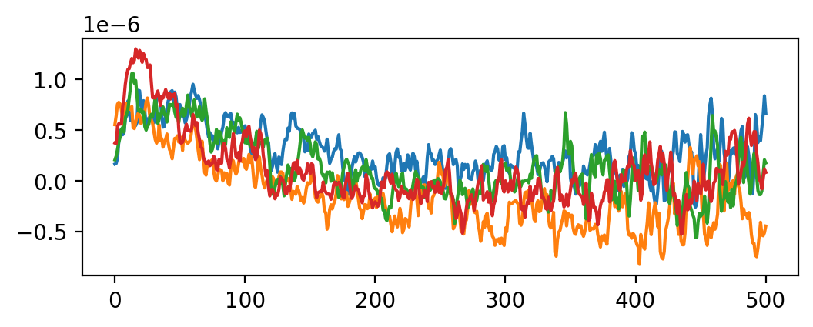

pyHSMM-MVPA
==========

`pyHSMM-MVPA`_ is an open-source Python package to estimate Hidden Semi-Markov Models in a Multivariate Pattern Analysis of electro-encephalographic data based on the method developed by Anderson, Zhang, Borst, & Walsh  ( [2016](https://psycnet.apa.org/doi/10.1037/rev0000030) ) and Borst & Anderson ( [2021](http://jelmerborst.nl/pubs/ACTR_HsMM_MVPA_BorstAnderson_preprint.pdf) )


Documentation
^^^^^^^^^^^^^
The package will be soon available through *pip*, in the meantime, to install pyhsmm-mvpa you can clone the repository using *git*

Open a terminal and type:

.. code-block:: console

    $ git clone https://github.com/gweindel/pyhsmm-mvpa.git
   
Then install the required dependencies:

- Python >= 3.7
- NumPy >= 1.18.1
- MNE >= 1.0
- Matplotlib >= 3.1.0
- xarray >= 2022.6.0

A recommended way of installing these dependency is to use a new conda environment (see `anaconda <https://www.anaconda.com/products/distribution>`__ for how to install conda):

.. code-block:: console

    $ conda create -n pyhsmm xarray mne 
    $ conda activate pyhsmm

Then naviguate to the cloned repository and import pyhsmm-mvpa in your favorite python IDE through:

.. code-block:: python

    import pyhsmm_mvpa as hsmm


# Demo on simulated data

### Importing libraries


```python
import numpy as np
import matplotlib.pyplot as plt
import xarray as xr
import seaborn as sns
from mne import channels

## Importing 
import pyhsmm_mvpa as hsmm
from pyhsmm_mvpa import simulations
```

### Simulating data


```python
cpus = 16 # For multiprocessing
path = 'simulated/'

n_events = 60 #Number of trials to simulate

sources = [['lateraloccipital-lh',1e-2, [np.random.gamma,2,15]],#One source = localization, acitvation amplitude and onset latencies
           ['postcentral-lh', 1e-2, [np.random.gamma, 2, 50]],
           ['posteriorcingulate-rh', 1e-2, [np.random.gamma, 2,40]],
           ['postcentral-rh', 1e-2, [np.random.gamma, 2,100]],
           ['postcentral-lh', 1e-10, [np.random.gamma, 2,75]]]#Equivalent to a response trigger as amplitude make it hardly visible

max_trial_length = 3000#length of a trial (ISI)

bump_frequency = 10.#Frequency of the simulated bumps
file = 'dataset_tutorial'
mne_path = path+file+'_raw.fif'

raw, generating_events = simulations.simulate(sources, n_events, max_trial_length, cpus, bump_frequency, file, path, overwrite=True)
```

    Aligning file name to MNE's convention
    Simulating dataset_tutorial_raw.fif in simulated/
    Overwriting existing file.
    Writing /home/gweindel/owncloud/projects/RUGUU/pyhsmm-mvpa/simulated/dataset_tutorial_raw.fif
    Closing /home/gweindel/owncloud/projects/RUGUU/pyhsmm-mvpa/simulated/dataset_tutorial_raw.fif
    [done]
    simulated/dataset_tutorial_raw.fif simulated


### Creating the event structure and plotting the raw data


```python
resp_trigger = int(np.max(np.unique(generating_events[:,2])))#Resp trigger is the last source in each trial
event_id = {'stimulus':0}
resp_id = {'response':resp_trigger}
events = generating_events[(generating_events[:,2] == 0) | (generating_events[:,2] == resp_trigger)]

%matplotlib qt
raw.copy().pick_types(eeg=True).plot(scalings=dict(eeg=10), events=events);
```

    Removing projector <Projection | PCA-v1, active : True, n_channels : 102>
    Removing projector <Projection | PCA-v2, active : True, n_channels : 102>
    Removing projector <Projection | PCA-v3, active : True, n_channels : 102>
    Using matplotlib as 2D backend.
    Opening raw-browser...


### Recovering number of sources as well as actual by-trial variation


```python
%matplotlib inline
number_of_sources = len(np.unique(generating_events[:,2])[1:])#one trigger = one source
random_source_times = np.zeros((int(len(generating_events)/(number_of_sources+1)), number_of_sources))

i,x = 1,0                  
while x < len(random_source_times):
    for j in np.arange(number_of_sources):#recovering the individual duration- of bump onset
        random_source_times[x,j] = generating_events[i,0] - generating_events[i-1,0]
        i += 1
    i += 1
    x += 1

plt.figure(dpi=200)
for source in random_source_times.T:#plotting these source durations
    sns.kdeplot(source, cut=0)
plt.xlim(0,500)
plt.show()
```

    Closing raw-browser...
    Channels marked as bad:
    none


    

    


## Demo of the HsMM Code for a single participant in a single condition based on the simulated data


```python
# Reading the data
eeg_dat = hsmm.utils.read_mne_EEG(mne_path, event_id, resp_id, raw.info['sfreq'],events, verbose=False)

```

    Processing participant simulated/dataset_tutorial_raw.fif
    Reading 0 ... 194999  =      0.000 ...   324.666 secs...
    N trials without response event: 0
    Applying reaction time trim to keep RTs between 0.001 and 5 seconds
    60 trials were retained for participant simulated/dataset_tutorial_raw.fif


```python
raw.info['sfreq']
```


    600.614990234375


```python
#example of usage of xarray
eeg_dat.sel(epochs=0,electrodes=['EEG 001','EEG 002','EEG 003']).plot.scatter(x='samples', y='data',hue='electrodes')
```


    [<matplotlib.collections.PathCollection at 0x7fc1b4436e60>,
     <matplotlib.collections.PathCollection at 0x7fc1b4437f10>,
     <matplotlib.collections.PathCollection at 0x7fc1b4437f70>]


    

    


```python
hsmm_dat, PCs, explained_var, means = hsmm.utils.transform_data(eeg_dat.data,'',
        apply_standard=False, single=True, n_comp=4)

hsmm_dat = hsmm.utils.stack_data(hsmm_dat,'',single=True)
```


```python
hsmm_dat
```


<div><svg style="position: absolute; width: 0; height: 0; overflow: hidden">
<defs>
<symbol id="icon-database" viewBox="0 0 32 32">
<path d="M16 0c-8.837 0-16 2.239-16 5v4c0 2.761 7.163 5 16 5s16-2.239 16-5v-4c0-2.761-7.163-5-16-5z"></path>
<path d="M16 17c-8.837 0-16-2.239-16-5v6c0 2.761 7.163 5 16 5s16-2.239 16-5v-6c0 2.761-7.163 5-16 5z"></path>
<path d="M16 26c-8.837 0-16-2.239-16-5v6c0 2.761 7.163 5 16 5s16-2.239 16-5v-6c0 2.761-7.163 5-16 5z"></path>
</symbol>
<symbol id="icon-file-text2" viewBox="0 0 32 32">
<path d="M28.681 7.159c-0.694-0.947-1.662-2.053-2.724-3.116s-2.169-2.030-3.116-2.724c-1.612-1.182-2.393-1.319-2.841-1.319h-15.5c-1.378 0-2.5 1.121-2.5 2.5v27c0 1.378 1.122 2.5 2.5 2.5h23c1.378 0 2.5-1.122 2.5-2.5v-19.5c0-0.448-0.137-1.23-1.319-2.841zM24.543 5.457c0.959 0.959 1.712 1.825 2.268 2.543h-4.811v-4.811c0.718 0.556 1.584 1.309 2.543 2.268zM28 29.5c0 0.271-0.229 0.5-0.5 0.5h-23c-0.271 0-0.5-0.229-0.5-0.5v-27c0-0.271 0.229-0.5 0.5-0.5 0 0 15.499-0 15.5 0v7c0 0.552 0.448 1 1 1h7v19.5z"></path>
<path d="M23 26h-14c-0.552 0-1-0.448-1-1s0.448-1 1-1h14c0.552 0 1 0.448 1 1s-0.448 1-1 1z"></path>
<path d="M23 22h-14c-0.552 0-1-0.448-1-1s0.448-1 1-1h14c0.552 0 1 0.448 1 1s-0.448 1-1 1z"></path>
<path d="M23 18h-14c-0.552 0-1-0.448-1-1s0.448-1 1-1h14c0.552 0 1 0.448 1 1s-0.448 1-1 1z"></path>
</symbol>
</defs>
</svg>
<style>/* CSS stylesheet for displaying xarray objects in jupyterlab.
 *
 */

:root {
  --xr-font-color0: var(--jp-content-font-color0, rgba(0, 0, 0, 1));
  --xr-font-color2: var(--jp-content-font-color2, rgba(0, 0, 0, 0.54));
  --xr-font-color3: var(--jp-content-font-color3, rgba(0, 0, 0, 0.38));
  --xr-border-color: var(--jp-border-color2, #e0e0e0);
  --xr-disabled-color: var(--jp-layout-color3, #bdbdbd);
  --xr-background-color: var(--jp-layout-color0, white);
  --xr-background-color-row-even: var(--jp-layout-color1, white);
  --xr-background-color-row-odd: var(--jp-layout-color2, #eeeeee);
}

html[theme=dark],
body[data-theme=dark],
body.vscode-dark {
  --xr-font-color0: rgba(255, 255, 255, 1);
  --xr-font-color2: rgba(255, 255, 255, 0.54);
  --xr-font-color3: rgba(255, 255, 255, 0.38);
  --xr-border-color: #1F1F1F;
  --xr-disabled-color: #515151;
  --xr-background-color: #111111;
  --xr-background-color-row-even: #111111;
  --xr-background-color-row-odd: #313131;
}

.xr-wrap {
  display: block !important;
  min-width: 300px;
  max-width: 700px;
}

.xr-text-repr-fallback {
  /* fallback to plain text repr when CSS is not injected (untrusted notebook) */
  display: none;
}

.xr-header {
  padding-top: 6px;
  padding-bottom: 6px;
  margin-bottom: 4px;
  border-bottom: solid 1px var(--xr-border-color);
}

.xr-header > div,
.xr-header > ul {
  display: inline;
  margin-top: 0;
  margin-bottom: 0;
}

.xr-obj-type,
.xr-array-name {
  margin-left: 2px;
  margin-right: 10px;
}

.xr-obj-type {
  color: var(--xr-font-color2);
}

.xr-sections {
  padding-left: 0 !important;
  display: grid;
  grid-template-columns: 150px auto auto 1fr 20px 20px;
}

.xr-section-item {
  display: contents;
}

.xr-section-item input {
  display: none;
}

.xr-section-item input + label {
  color: var(--xr-disabled-color);
}

.xr-section-item input:enabled + label {
  cursor: pointer;
  color: var(--xr-font-color2);
}

.xr-section-item input:enabled + label:hover {
  color: var(--xr-font-color0);
}

.xr-section-summary {
  grid-column: 1;
  color: var(--xr-font-color2);
  font-weight: 500;
}

.xr-section-summary > span {
  display: inline-block;
  padding-left: 0.5em;
}

.xr-section-summary-in:disabled + label {
  color: var(--xr-font-color2);
}

.xr-section-summary-in + label:before {
  display: inline-block;
  content: '►';
  font-size: 11px;
  width: 15px;
  text-align: center;
}

.xr-section-summary-in:disabled + label:before {
  color: var(--xr-disabled-color);
}

.xr-section-summary-in:checked + label:before {
  content: '▼';
}

.xr-section-summary-in:checked + label > span {
  display: none;
}

.xr-section-summary,
.xr-section-inline-details {
  padding-top: 4px;
  padding-bottom: 4px;
}

.xr-section-inline-details {
  grid-column: 2 / -1;
}

.xr-section-details {
  display: none;
  grid-column: 1 / -1;
  margin-bottom: 5px;
}

.xr-section-summary-in:checked ~ .xr-section-details {
  display: contents;
}

.xr-array-wrap {
  grid-column: 1 / -1;
  display: grid;
  grid-template-columns: 20px auto;
}

.xr-array-wrap > label {
  grid-column: 1;
  vertical-align: top;
}

.xr-preview {
  color: var(--xr-font-color3);
}

.xr-array-preview,
.xr-array-data {
  padding: 0 5px !important;
  grid-column: 2;
}

.xr-array-data,
.xr-array-in:checked ~ .xr-array-preview {
  display: none;
}

.xr-array-in:checked ~ .xr-array-data,
.xr-array-preview {
  display: inline-block;
}

.xr-dim-list {
  display: inline-block !important;
  list-style: none;
  padding: 0 !important;
  margin: 0;
}

.xr-dim-list li {
  display: inline-block;
  padding: 0;
  margin: 0;
}

.xr-dim-list:before {
  content: '(';
}

.xr-dim-list:after {
  content: ')';
}

.xr-dim-list li:not(:last-child):after {
  content: ',';
  padding-right: 5px;
}

.xr-has-index {
  font-weight: bold;
}

.xr-var-list,
.xr-var-item {
  display: contents;
}

.xr-var-item > div,
.xr-var-item label,
.xr-var-item > .xr-var-name span {
  background-color: var(--xr-background-color-row-even);
  margin-bottom: 0;
}

.xr-var-item > .xr-var-name:hover span {
  padding-right: 5px;
}

.xr-var-list > li:nth-child(odd) > div,
.xr-var-list > li:nth-child(odd) > label,
.xr-var-list > li:nth-child(odd) > .xr-var-name span {
  background-color: var(--xr-background-color-row-odd);
}

.xr-var-name {
  grid-column: 1;
}

.xr-var-dims {
  grid-column: 2;
}

.xr-var-dtype {
  grid-column: 3;
  text-align: right;
  color: var(--xr-font-color2);
}

.xr-var-preview {
  grid-column: 4;
}

.xr-var-name,
.xr-var-dims,
.xr-var-dtype,
.xr-preview,
.xr-attrs dt {
  white-space: nowrap;
  overflow: hidden;
  text-overflow: ellipsis;
  padding-right: 10px;
}

.xr-var-name:hover,
.xr-var-dims:hover,
.xr-var-dtype:hover,
.xr-attrs dt:hover {
  overflow: visible;
  width: auto;
  z-index: 1;
}

.xr-var-attrs,
.xr-var-data {
  display: none;
  background-color: var(--xr-background-color) !important;
  padding-bottom: 5px !important;
}

.xr-var-attrs-in:checked ~ .xr-var-attrs,
.xr-var-data-in:checked ~ .xr-var-data {
  display: block;
}

.xr-var-data > table {
  float: right;
}

.xr-var-name span,
.xr-var-data,
.xr-attrs {
  padding-left: 25px !important;
}

.xr-attrs,
.xr-var-attrs,
.xr-var-data {
  grid-column: 1 / -1;
}

dl.xr-attrs {
  padding: 0;
  margin: 0;
  display: grid;
  grid-template-columns: 125px auto;
}

.xr-attrs dt,
.xr-attrs dd {
  padding: 0;
  margin: 0;
  float: left;
  padding-right: 10px;
  width: auto;
}

.xr-attrs dt {
  font-weight: normal;
  grid-column: 1;
}

.xr-attrs dt:hover span {
  display: inline-block;
  background: var(--xr-background-color);
  padding-right: 10px;
}

.xr-attrs dd {
  grid-column: 2;
  white-space: pre-wrap;
  word-break: break-all;
}

.xr-icon-database,
.xr-icon-file-text2 {
  display: inline-block;
  vertical-align: middle;
  width: 1em;
  height: 1.5em !important;
  stroke-width: 0;
  stroke: currentColor;
  fill: currentColor;
}
</style><pre class='xr-text-repr-fallback'>&lt;xarray.Dataset&gt;
Dimensions:      (component: 4, all_samples: 32168, participant: 1, trial: 60)
Coordinates:
  * component    (component) int64 0 1 2 3
  * all_samples  (all_samples) object MultiIndex
  * epochs       (all_samples) int64 0 0 0 0 0 0 0 0 ... 59 59 59 59 59 59 59 59
  * samples      (all_samples) int64 0 1 2 3 4 5 6 ... 368 369 370 371 372 373
  * trial        (trial) int64 0 1 2 3 4 5 6 7 8 ... 51 52 53 54 55 56 57 58 59
Dimensions without coordinates: participant
Data variables:
    data         (participant, component, all_samples) float64 -0.2186 ... -0...
    starts       (trial) int64 0 774 1413 2022 2638 ... 30296 30930 31331 31794
    ends         (trial) int64 773 1412 2021 2637 ... 30929 31330 31793 32167</pre><div class='xr-wrap' style='display:none'><div class='xr-header'><div class='xr-obj-type'>xarray.Dataset</div></div><ul class='xr-sections'><li class='xr-section-item'><input id='section-e28042da-acc2-4422-b605-ffe41c2c0c96' class='xr-section-summary-in' type='checkbox' disabled ><label for='section-e28042da-acc2-4422-b605-ffe41c2c0c96' class='xr-section-summary'  title='Expand/collapse section'>Dimensions:</label><div class='xr-section-inline-details'><ul class='xr-dim-list'><li><span class='xr-has-index'>component</span>: 4</li><li><span class='xr-has-index'>all_samples</span>: 32168</li><li><span>participant</span>: 1</li><li><span class='xr-has-index'>trial</span>: 60</li></ul></div><div class='xr-section-details'></div></li><li class='xr-section-item'><input id='section-b7b48a8f-cbe0-4bd7-9980-11819c975d85' class='xr-section-summary-in' type='checkbox'  checked><label for='section-b7b48a8f-cbe0-4bd7-9980-11819c975d85' class='xr-section-summary' >Coordinates: <span>(5)</span></label><div class='xr-section-inline-details'></div><div class='xr-section-details'><ul class='xr-var-list'><li class='xr-var-item'><div class='xr-var-name'><span class='xr-has-index'>component</span></div><div class='xr-var-dims'>(component)</div><div class='xr-var-dtype'>int64</div><div class='xr-var-preview xr-preview'>0 1 2 3</div><input id='attrs-099f72a5-382a-4384-89d1-ceaaf486c54f' class='xr-var-attrs-in' type='checkbox' disabled><label for='attrs-099f72a5-382a-4384-89d1-ceaaf486c54f' title='Show/Hide attributes'><svg class='icon xr-icon-file-text2'><use xlink:href='#icon-file-text2'></use></svg></label><input id='data-abe326a0-c3e8-44f4-a5fc-6300894e54cc' class='xr-var-data-in' type='checkbox'><label for='data-abe326a0-c3e8-44f4-a5fc-6300894e54cc' title='Show/Hide data repr'><svg class='icon xr-icon-database'><use xlink:href='#icon-database'></use></svg></label><div class='xr-var-attrs'><dl class='xr-attrs'></dl></div><div class='xr-var-data'><pre>array([0, 1, 2, 3])</pre></div></li><li class='xr-var-item'><div class='xr-var-name'><span class='xr-has-index'>all_samples</span></div><div class='xr-var-dims'>(all_samples)</div><div class='xr-var-dtype'>object</div><div class='xr-var-preview xr-preview'>MultiIndex</div><input id='attrs-efb10150-f223-4590-b38c-8be65afff350' class='xr-var-attrs-in' type='checkbox' disabled><label for='attrs-efb10150-f223-4590-b38c-8be65afff350' title='Show/Hide attributes'><svg class='icon xr-icon-file-text2'><use xlink:href='#icon-file-text2'></use></svg></label><input id='data-e6188d0d-9c7b-42b4-bf72-63d53c4fae23' class='xr-var-data-in' type='checkbox'><label for='data-e6188d0d-9c7b-42b4-bf72-63d53c4fae23' title='Show/Hide data repr'><svg class='icon xr-icon-database'><use xlink:href='#icon-database'></use></svg></label><div class='xr-var-attrs'><dl class='xr-attrs'></dl></div><div class='xr-var-data'><pre>array([(0, 0), (0, 1), (0, 2), ..., (59, 371), (59, 372), (59, 373)],
      dtype=object)</pre></div></li><li class='xr-var-item'><div class='xr-var-name'><span class='xr-has-index'>epochs</span></div><div class='xr-var-dims'>(all_samples)</div><div class='xr-var-dtype'>int64</div><div class='xr-var-preview xr-preview'>0 0 0 0 0 0 0 ... 59 59 59 59 59 59</div><input id='attrs-72185240-3f1c-47da-80a5-2c236b511943' class='xr-var-attrs-in' type='checkbox' disabled><label for='attrs-72185240-3f1c-47da-80a5-2c236b511943' title='Show/Hide attributes'><svg class='icon xr-icon-file-text2'><use xlink:href='#icon-file-text2'></use></svg></label><input id='data-a909fad3-861d-4bc0-8ceb-c2650271a720' class='xr-var-data-in' type='checkbox'><label for='data-a909fad3-861d-4bc0-8ceb-c2650271a720' title='Show/Hide data repr'><svg class='icon xr-icon-database'><use xlink:href='#icon-database'></use></svg></label><div class='xr-var-attrs'><dl class='xr-attrs'></dl></div><div class='xr-var-data'><pre>array([ 0,  0,  0, ..., 59, 59, 59])</pre></div></li><li class='xr-var-item'><div class='xr-var-name'><span class='xr-has-index'>samples</span></div><div class='xr-var-dims'>(all_samples)</div><div class='xr-var-dtype'>int64</div><div class='xr-var-preview xr-preview'>0 1 2 3 4 5 ... 369 370 371 372 373</div><input id='attrs-9a9663e2-fa36-42b2-b1b3-883ee6da6282' class='xr-var-attrs-in' type='checkbox' disabled><label for='attrs-9a9663e2-fa36-42b2-b1b3-883ee6da6282' title='Show/Hide attributes'><svg class='icon xr-icon-file-text2'><use xlink:href='#icon-file-text2'></use></svg></label><input id='data-6b9be2cb-daea-4a63-a14f-a30f74e5485f' class='xr-var-data-in' type='checkbox'><label for='data-6b9be2cb-daea-4a63-a14f-a30f74e5485f' title='Show/Hide data repr'><svg class='icon xr-icon-database'><use xlink:href='#icon-database'></use></svg></label><div class='xr-var-attrs'><dl class='xr-attrs'></dl></div><div class='xr-var-data'><pre>array([  0,   1,   2, ..., 371, 372, 373])</pre></div></li><li class='xr-var-item'><div class='xr-var-name'><span class='xr-has-index'>trial</span></div><div class='xr-var-dims'>(trial)</div><div class='xr-var-dtype'>int64</div><div class='xr-var-preview xr-preview'>0 1 2 3 4 5 6 ... 54 55 56 57 58 59</div><input id='attrs-beeeaa6d-bda7-4953-8042-ef24eb8742ee' class='xr-var-attrs-in' type='checkbox' disabled><label for='attrs-beeeaa6d-bda7-4953-8042-ef24eb8742ee' title='Show/Hide attributes'><svg class='icon xr-icon-file-text2'><use xlink:href='#icon-file-text2'></use></svg></label><input id='data-e553ed1d-fb45-4a4f-b87e-8e7cbb11d1e1' class='xr-var-data-in' type='checkbox'><label for='data-e553ed1d-fb45-4a4f-b87e-8e7cbb11d1e1' title='Show/Hide data repr'><svg class='icon xr-icon-database'><use xlink:href='#icon-database'></use></svg></label><div class='xr-var-attrs'><dl class='xr-attrs'></dl></div><div class='xr-var-data'><pre>array([ 0,  1,  2,  3,  4,  5,  6,  7,  8,  9, 10, 11, 12, 13, 14, 15, 16, 17,
       18, 19, 20, 21, 22, 23, 24, 25, 26, 27, 28, 29, 30, 31, 32, 33, 34, 35,
       36, 37, 38, 39, 40, 41, 42, 43, 44, 45, 46, 47, 48, 49, 50, 51, 52, 53,
       54, 55, 56, 57, 58, 59])</pre></div></li></ul></div></li><li class='xr-section-item'><input id='section-06f3ac78-c2b6-48eb-96ac-5facb088a552' class='xr-section-summary-in' type='checkbox'  checked><label for='section-06f3ac78-c2b6-48eb-96ac-5facb088a552' class='xr-section-summary' >Data variables: <span>(3)</span></label><div class='xr-section-inline-details'></div><div class='xr-section-details'><ul class='xr-var-list'><li class='xr-var-item'><div class='xr-var-name'><span>data</span></div><div class='xr-var-dims'>(participant, component, all_samples)</div><div class='xr-var-dtype'>float64</div><div class='xr-var-preview xr-preview'>-0.2186 -0.2191 ... -0.1289 -0.1354</div><input id='attrs-67ca503b-1c50-4d42-bdb0-a6569f4859a9' class='xr-var-attrs-in' type='checkbox' disabled><label for='attrs-67ca503b-1c50-4d42-bdb0-a6569f4859a9' title='Show/Hide attributes'><svg class='icon xr-icon-file-text2'><use xlink:href='#icon-file-text2'></use></svg></label><input id='data-e6d5d8de-44b1-4a01-8cdb-d3b42aa8bac9' class='xr-var-data-in' type='checkbox'><label for='data-e6d5d8de-44b1-4a01-8cdb-d3b42aa8bac9' title='Show/Hide data repr'><svg class='icon xr-icon-database'><use xlink:href='#icon-database'></use></svg></label><div class='xr-var-attrs'><dl class='xr-attrs'></dl></div><div class='xr-var-data'><pre>array([[[-0.21859507, -0.21914586, -0.21969777, ..., -0.44668688,
         -0.45036622, -0.43275995],
        [ 0.24801113,  0.24719355,  0.24637304, ...,  0.42050994,
          0.42264859,  0.4122375 ],
        [-0.01834456, -0.01757271, -0.01679852, ..., -0.28887277,
         -0.29457442, -0.26811356],
        [-0.19216773, -0.18837968, -0.18458037, ..., -0.13045425,
         -0.12894807, -0.13537171]]])</pre></div></li><li class='xr-var-item'><div class='xr-var-name'><span>starts</span></div><div class='xr-var-dims'>(trial)</div><div class='xr-var-dtype'>int64</div><div class='xr-var-preview xr-preview'>0 774 1413 ... 30930 31331 31794</div><input id='attrs-476612bc-c2b8-4f49-a12f-71c6d7d3d23b' class='xr-var-attrs-in' type='checkbox' disabled><label for='attrs-476612bc-c2b8-4f49-a12f-71c6d7d3d23b' title='Show/Hide attributes'><svg class='icon xr-icon-file-text2'><use xlink:href='#icon-file-text2'></use></svg></label><input id='data-642aeeea-cbdf-4542-a370-763f0ec25a6f' class='xr-var-data-in' type='checkbox'><label for='data-642aeeea-cbdf-4542-a370-763f0ec25a6f' title='Show/Hide data repr'><svg class='icon xr-icon-database'><use xlink:href='#icon-database'></use></svg></label><div class='xr-var-attrs'><dl class='xr-attrs'></dl></div><div class='xr-var-data'><pre>array([    0,   774,  1413,  2022,  2638,  3116,  3479,  3802,  4257,
        4836,  5289,  5834,  6299,  6887,  7205,  7693,  8208,  9028,
        9598,  9920, 10159, 10422, 10822, 11118, 11568, 11809, 12606,
       13042, 13705, 14421, 15126, 15713, 16516, 17060, 17564, 18034,
       18898, 19474, 19918, 20475, 21061, 21775, 22589, 23518, 24176,
       24871, 25304, 25579, 26200, 26440, 27231, 27774, 28271, 28832,
       29343, 29831, 30296, 30930, 31331, 31794])</pre></div></li><li class='xr-var-item'><div class='xr-var-name'><span>ends</span></div><div class='xr-var-dims'>(trial)</div><div class='xr-var-dtype'>int64</div><div class='xr-var-preview xr-preview'>773 1412 2021 ... 31330 31793 32167</div><input id='attrs-fe5c07ee-21e6-4060-a7be-49f221327b59' class='xr-var-attrs-in' type='checkbox' disabled><label for='attrs-fe5c07ee-21e6-4060-a7be-49f221327b59' title='Show/Hide attributes'><svg class='icon xr-icon-file-text2'><use xlink:href='#icon-file-text2'></use></svg></label><input id='data-505d8ead-8824-4070-91cc-3395aa5a1fd2' class='xr-var-data-in' type='checkbox'><label for='data-505d8ead-8824-4070-91cc-3395aa5a1fd2' title='Show/Hide data repr'><svg class='icon xr-icon-database'><use xlink:href='#icon-database'></use></svg></label><div class='xr-var-attrs'><dl class='xr-attrs'></dl></div><div class='xr-var-data'><pre>array([  773,  1412,  2021,  2637,  3115,  3478,  3801,  4256,  4835,
        5288,  5833,  6298,  6886,  7204,  7692,  8207,  9027,  9597,
        9919, 10158, 10421, 10821, 11117, 11567, 11808, 12605, 13041,
       13704, 14420, 15125, 15712, 16515, 17059, 17563, 18033, 18897,
       19473, 19917, 20474, 21060, 21774, 22588, 23517, 24175, 24870,
       25303, 25578, 26199, 26439, 27230, 27773, 28270, 28831, 29342,
       29830, 30295, 30929, 31330, 31793, 32167])</pre></div></li></ul></div></li><li class='xr-section-item'><input id='section-df9bb695-7356-4a06-9029-c633850938ce' class='xr-section-summary-in' type='checkbox' disabled ><label for='section-df9bb695-7356-4a06-9029-c633850938ce' class='xr-section-summary'  title='Expand/collapse section'>Attributes: <span>(0)</span></label><div class='xr-section-inline-details'></div><div class='xr-section-details'><dl class='xr-attrs'></dl></div></li></ul></div></div>


# Estimating a 4 bump model


```python
init = hsmm.models.hsmm(hsmm_dat.data.T[:,:,0], hsmm_dat.starts.data, 
                 hsmm_dat.ends.data, sf=eeg_dat.sfreq, bump_width=50, cpus=16)

estimates = init.fit_single(number_of_sources-1)
```

    Estimating parameters for 4 bumps model
    Parameters estimated for 4 bumps model


### Visualizing results of the fit


```python
selected = estimates
bump_times_selected = init.bump_times(selected.eventprobs)
mean_bump_times_selected = np.mean(bump_times_selected, axis=0)

positions = np.delete(channels.layout._find_topomap_coords(raw.info, 'eeg'),52,axis=0)#inferring electrode location
electrodes_selected = hsmm.utils.reconstruct(selected.magnitudes, PCs, explained_var, means)
```


```python
hsmm.visu.plot_topo_timecourse(electrodes_selected, mean_bump_times_selected, positions, 
                               bump_size=init.bump_width_samples, magnify=5, figsize=(12,2),
                                time_step = 1,  times_to_display = np.mean(init.ends - init.starts))
```


    

    


```python
ax = hsmm.visu.plot_latencies_average(bump_times_selected, init.bump_width_samples, 1, errs='std', times_to_display = np.mean(init.ends - init.starts))
ax.set_ylabel('your label here');
```


    

    


```python
hsmm.visu.plot_latencies_gamma(selected.parameters.dropna('stage').values, init.bump_width_samples,  times_to_display = np.mean(init.ends - init.starts));
```


    

    


```python
hsmm.visu.plot_distribution(selected.eventprobs.mean(dim=['trial']), xlims=(0,1000))
hsmm.visu.plot_distribution(selected.eventprobs.mean(dim=['trial']), xlims=(0,1000), survival=True);
```


    

    


    

    


## Comparing with ground truth


```python
plt.figure(dpi=150)
colors = sns.color_palette(None, number_of_sources)#['darkblue','indianred','darkgreen','red','purple','grey']
#print(np.mean(random_source_times, axis=0)- (estimates.parameters.dropna('stage').isel(params=1)*2+np.concatenate([[0],np.repeat(init.bump_width_samples,number_of_sources-1)])))
plt.scatter(np.mean(random_source_times, axis=0), estimates.parameters.dropna('stage').isel(params=1)*2+np.concatenate([[0],np.repeat(init.bump_width_samples,number_of_sources-1)]), color=colors,s=50)
plt.plot([np.min(np.mean(random_source_times,axis=0)),np.max(np.mean(random_source_times,axis=0))],
         [np.min(np.mean(random_source_times,axis=0)),np.max(np.mean(random_source_times,axis=0))],'--');
plt.title('Actual vs estimated stage durations')
plt.xlabel('Estimated stage duration')
plt.ylabel('Actual stage duration')
plt.show()

```


    

    


```python
positions = np.delete(channels.layout._find_topomap_coords(raw.info, 'eeg'),52,axis=0)#inferring electrode location
electrodes = hsmm.utils.reconstruct(estimates.magnitudes, PCs, explained_var, means)

hsmm.visu.plot_topo_timecourse(electrodes, np.mean(init.bump_times(estimates.eventprobs), axis=0), positions,#inferring electrode location, 
        bump_size=init.bump_width_samples, time_step = 1, magnify=4, figsize=(13,2), title='Actual vs estimated bump onsets',
        times_to_display = np.mean(np.cumsum(random_source_times,axis=1),axis=0))
```


    

    


```python

fig, ax= plt.subplots(number_of_sources-1,1, figsize=(5,3.5*number_of_sources))
ax[0].set_title('Comparing true vs estimated single trial stage durations')
i = 0
gen_bump_location = np.cumsum(random_source_times[:,:-1], axis=1)
for bump in init.bump_times(estimates.eventprobs)[:,:number_of_sources-1].T:
    sns.regplot(x=gen_bump_location[:,i].T, y=bump, ax=ax[i], color=colors[i])
    ax[i].plot([np.min(bump), np.max(bump)], [np.min(bump), np.max(bump)],'--')
    i+= 1
```


    

    


# N_bump selection: iterative backward estimates


```python
bests = init.backward_estimation()

bests
```

    Estimating all solutions for maximal number of bumps (7) with 0 random starting points
    Estimating parameters for 7 bumps model
    Parameters estimated for 7 bumps model


<div><svg style="position: absolute; width: 0; height: 0; overflow: hidden">
<defs>
<symbol id="icon-database" viewBox="0 0 32 32">
<path d="M16 0c-8.837 0-16 2.239-16 5v4c0 2.761 7.163 5 16 5s16-2.239 16-5v-4c0-2.761-7.163-5-16-5z"></path>
<path d="M16 17c-8.837 0-16-2.239-16-5v6c0 2.761 7.163 5 16 5s16-2.239 16-5v-6c0 2.761-7.163 5-16 5z"></path>
<path d="M16 26c-8.837 0-16-2.239-16-5v6c0 2.761 7.163 5 16 5s16-2.239 16-5v-6c0 2.761-7.163 5-16 5z"></path>
</symbol>
<symbol id="icon-file-text2" viewBox="0 0 32 32">
<path d="M28.681 7.159c-0.694-0.947-1.662-2.053-2.724-3.116s-2.169-2.030-3.116-2.724c-1.612-1.182-2.393-1.319-2.841-1.319h-15.5c-1.378 0-2.5 1.121-2.5 2.5v27c0 1.378 1.122 2.5 2.5 2.5h23c1.378 0 2.5-1.122 2.5-2.5v-19.5c0-0.448-0.137-1.23-1.319-2.841zM24.543 5.457c0.959 0.959 1.712 1.825 2.268 2.543h-4.811v-4.811c0.718 0.556 1.584 1.309 2.543 2.268zM28 29.5c0 0.271-0.229 0.5-0.5 0.5h-23c-0.271 0-0.5-0.229-0.5-0.5v-27c0-0.271 0.229-0.5 0.5-0.5 0 0 15.499-0 15.5 0v7c0 0.552 0.448 1 1 1h7v19.5z"></path>
<path d="M23 26h-14c-0.552 0-1-0.448-1-1s0.448-1 1-1h14c0.552 0 1 0.448 1 1s-0.448 1-1 1z"></path>
<path d="M23 22h-14c-0.552 0-1-0.448-1-1s0.448-1 1-1h14c0.552 0 1 0.448 1 1s-0.448 1-1 1z"></path>
<path d="M23 18h-14c-0.552 0-1-0.448-1-1s0.448-1 1-1h14c0.552 0 1 0.448 1 1s-0.448 1-1 1z"></path>
</symbol>
</defs>
</svg>
<style>/* CSS stylesheet for displaying xarray objects in jupyterlab.
 *
 */

:root {
  --xr-font-color0: var(--jp-content-font-color0, rgba(0, 0, 0, 1));
  --xr-font-color2: var(--jp-content-font-color2, rgba(0, 0, 0, 0.54));
  --xr-font-color3: var(--jp-content-font-color3, rgba(0, 0, 0, 0.38));
  --xr-border-color: var(--jp-border-color2, #e0e0e0);
  --xr-disabled-color: var(--jp-layout-color3, #bdbdbd);
  --xr-background-color: var(--jp-layout-color0, white);
  --xr-background-color-row-even: var(--jp-layout-color1, white);
  --xr-background-color-row-odd: var(--jp-layout-color2, #eeeeee);
}

html[theme=dark],
body[data-theme=dark],
body.vscode-dark {
  --xr-font-color0: rgba(255, 255, 255, 1);
  --xr-font-color2: rgba(255, 255, 255, 0.54);
  --xr-font-color3: rgba(255, 255, 255, 0.38);
  --xr-border-color: #1F1F1F;
  --xr-disabled-color: #515151;
  --xr-background-color: #111111;
  --xr-background-color-row-even: #111111;
  --xr-background-color-row-odd: #313131;
}

.xr-wrap {
  display: block !important;
  min-width: 300px;
  max-width: 700px;
}

.xr-text-repr-fallback {
  /* fallback to plain text repr when CSS is not injected (untrusted notebook) */
  display: none;
}

.xr-header {
  padding-top: 6px;
  padding-bottom: 6px;
  margin-bottom: 4px;
  border-bottom: solid 1px var(--xr-border-color);
}

.xr-header > div,
.xr-header > ul {
  display: inline;
  margin-top: 0;
  margin-bottom: 0;
}

.xr-obj-type,
.xr-array-name {
  margin-left: 2px;
  margin-right: 10px;
}

.xr-obj-type {
  color: var(--xr-font-color2);
}

.xr-sections {
  padding-left: 0 !important;
  display: grid;
  grid-template-columns: 150px auto auto 1fr 20px 20px;
}

.xr-section-item {
  display: contents;
}

.xr-section-item input {
  display: none;
}

.xr-section-item input + label {
  color: var(--xr-disabled-color);
}

.xr-section-item input:enabled + label {
  cursor: pointer;
  color: var(--xr-font-color2);
}

.xr-section-item input:enabled + label:hover {
  color: var(--xr-font-color0);
}

.xr-section-summary {
  grid-column: 1;
  color: var(--xr-font-color2);
  font-weight: 500;
}

.xr-section-summary > span {
  display: inline-block;
  padding-left: 0.5em;
}

.xr-section-summary-in:disabled + label {
  color: var(--xr-font-color2);
}

.xr-section-summary-in + label:before {
  display: inline-block;
  content: '►';
  font-size: 11px;
  width: 15px;
  text-align: center;
}

.xr-section-summary-in:disabled + label:before {
  color: var(--xr-disabled-color);
}

.xr-section-summary-in:checked + label:before {
  content: '▼';
}

.xr-section-summary-in:checked + label > span {
  display: none;
}

.xr-section-summary,
.xr-section-inline-details {
  padding-top: 4px;
  padding-bottom: 4px;
}

.xr-section-inline-details {
  grid-column: 2 / -1;
}

.xr-section-details {
  display: none;
  grid-column: 1 / -1;
  margin-bottom: 5px;
}

.xr-section-summary-in:checked ~ .xr-section-details {
  display: contents;
}

.xr-array-wrap {
  grid-column: 1 / -1;
  display: grid;
  grid-template-columns: 20px auto;
}

.xr-array-wrap > label {
  grid-column: 1;
  vertical-align: top;
}

.xr-preview {
  color: var(--xr-font-color3);
}

.xr-array-preview,
.xr-array-data {
  padding: 0 5px !important;
  grid-column: 2;
}

.xr-array-data,
.xr-array-in:checked ~ .xr-array-preview {
  display: none;
}

.xr-array-in:checked ~ .xr-array-data,
.xr-array-preview {
  display: inline-block;
}

.xr-dim-list {
  display: inline-block !important;
  list-style: none;
  padding: 0 !important;
  margin: 0;
}

.xr-dim-list li {
  display: inline-block;
  padding: 0;
  margin: 0;
}

.xr-dim-list:before {
  content: '(';
}

.xr-dim-list:after {
  content: ')';
}

.xr-dim-list li:not(:last-child):after {
  content: ',';
  padding-right: 5px;
}

.xr-has-index {
  font-weight: bold;
}

.xr-var-list,
.xr-var-item {
  display: contents;
}

.xr-var-item > div,
.xr-var-item label,
.xr-var-item > .xr-var-name span {
  background-color: var(--xr-background-color-row-even);
  margin-bottom: 0;
}

.xr-var-item > .xr-var-name:hover span {
  padding-right: 5px;
}

.xr-var-list > li:nth-child(odd) > div,
.xr-var-list > li:nth-child(odd) > label,
.xr-var-list > li:nth-child(odd) > .xr-var-name span {
  background-color: var(--xr-background-color-row-odd);
}

.xr-var-name {
  grid-column: 1;
}

.xr-var-dims {
  grid-column: 2;
}

.xr-var-dtype {
  grid-column: 3;
  text-align: right;
  color: var(--xr-font-color2);
}

.xr-var-preview {
  grid-column: 4;
}

.xr-var-name,
.xr-var-dims,
.xr-var-dtype,
.xr-preview,
.xr-attrs dt {
  white-space: nowrap;
  overflow: hidden;
  text-overflow: ellipsis;
  padding-right: 10px;
}

.xr-var-name:hover,
.xr-var-dims:hover,
.xr-var-dtype:hover,
.xr-attrs dt:hover {
  overflow: visible;
  width: auto;
  z-index: 1;
}

.xr-var-attrs,
.xr-var-data {
  display: none;
  background-color: var(--xr-background-color) !important;
  padding-bottom: 5px !important;
}

.xr-var-attrs-in:checked ~ .xr-var-attrs,
.xr-var-data-in:checked ~ .xr-var-data {
  display: block;
}

.xr-var-data > table {
  float: right;
}

.xr-var-name span,
.xr-var-data,
.xr-attrs {
  padding-left: 25px !important;
}

.xr-attrs,
.xr-var-attrs,
.xr-var-data {
  grid-column: 1 / -1;
}

dl.xr-attrs {
  padding: 0;
  margin: 0;
  display: grid;
  grid-template-columns: 125px auto;
}

.xr-attrs dt,
.xr-attrs dd {
  padding: 0;
  margin: 0;
  float: left;
  padding-right: 10px;
  width: auto;
}

.xr-attrs dt {
  font-weight: normal;
  grid-column: 1;
}

.xr-attrs dt:hover span {
  display: inline-block;
  background: var(--xr-background-color);
  padding-right: 10px;
}

.xr-attrs dd {
  grid-column: 2;
  white-space: pre-wrap;
  word-break: break-all;
}

.xr-icon-database,
.xr-icon-file-text2 {
  display: inline-block;
  vertical-align: middle;
  width: 1em;
  height: 1.5em !important;
  stroke-width: 0;
  stroke: currentColor;
  fill: currentColor;
}
</style><pre class='xr-text-repr-fallback'>&lt;xarray.Dataset&gt;
Dimensions:      (n_bumps: 7, stage: 8, params: 2, component: 4, bump: 7,
                  samples: 929, trial: 60)
Coordinates:
  * n_bumps      (n_bumps) int64 7 6 5 4 3 2 1
Dimensions without coordinates: stage, params, component, bump, samples, trial
Data variables:
    likelihoods  (n_bumps) float64 1.711e+03 1.995e+03 ... 1.166e+03 406.9
    parameters   (n_bumps, stage, params) float64 2.0 13.18 2.0 ... nan nan nan
    magnitudes   (n_bumps, component, bump) float64 -1.026 4.417 ... nan nan
    eventprobs   (n_bumps, samples, trial, bump) float64 0.0 0.0 0.0 ... nan nan</pre><div class='xr-wrap' style='display:none'><div class='xr-header'><div class='xr-obj-type'>xarray.Dataset</div></div><ul class='xr-sections'><li class='xr-section-item'><input id='section-504445f3-18e8-409d-bd53-d6ce19f3def1' class='xr-section-summary-in' type='checkbox' disabled ><label for='section-504445f3-18e8-409d-bd53-d6ce19f3def1' class='xr-section-summary'  title='Expand/collapse section'>Dimensions:</label><div class='xr-section-inline-details'><ul class='xr-dim-list'><li><span class='xr-has-index'>n_bumps</span>: 7</li><li><span>stage</span>: 8</li><li><span>params</span>: 2</li><li><span>component</span>: 4</li><li><span>bump</span>: 7</li><li><span>samples</span>: 929</li><li><span>trial</span>: 60</li></ul></div><div class='xr-section-details'></div></li><li class='xr-section-item'><input id='section-02c7ea5d-884f-4ff3-9378-a29548f33ecb' class='xr-section-summary-in' type='checkbox'  checked><label for='section-02c7ea5d-884f-4ff3-9378-a29548f33ecb' class='xr-section-summary' >Coordinates: <span>(1)</span></label><div class='xr-section-inline-details'></div><div class='xr-section-details'><ul class='xr-var-list'><li class='xr-var-item'><div class='xr-var-name'><span class='xr-has-index'>n_bumps</span></div><div class='xr-var-dims'>(n_bumps)</div><div class='xr-var-dtype'>int64</div><div class='xr-var-preview xr-preview'>7 6 5 4 3 2 1</div><input id='attrs-03fb6c66-c9da-4cdd-8fbe-1fe88ac95769' class='xr-var-attrs-in' type='checkbox' disabled><label for='attrs-03fb6c66-c9da-4cdd-8fbe-1fe88ac95769' title='Show/Hide attributes'><svg class='icon xr-icon-file-text2'><use xlink:href='#icon-file-text2'></use></svg></label><input id='data-68445a34-8638-4d9a-9b75-fbdf39abb2e4' class='xr-var-data-in' type='checkbox'><label for='data-68445a34-8638-4d9a-9b75-fbdf39abb2e4' title='Show/Hide data repr'><svg class='icon xr-icon-database'><use xlink:href='#icon-database'></use></svg></label><div class='xr-var-attrs'><dl class='xr-attrs'></dl></div><div class='xr-var-data'><pre>array([7, 6, 5, 4, 3, 2, 1])</pre></div></li></ul></div></li><li class='xr-section-item'><input id='section-7e07d067-58ae-468c-84e4-4a5f09f5438f' class='xr-section-summary-in' type='checkbox'  checked><label for='section-7e07d067-58ae-468c-84e4-4a5f09f5438f' class='xr-section-summary' >Data variables: <span>(4)</span></label><div class='xr-section-inline-details'></div><div class='xr-section-details'><ul class='xr-var-list'><li class='xr-var-item'><div class='xr-var-name'><span>likelihoods</span></div><div class='xr-var-dims'>(n_bumps)</div><div class='xr-var-dtype'>float64</div><div class='xr-var-preview xr-preview'>1.711e+03 1.995e+03 ... 406.9</div><input id='attrs-cd777564-e68d-4521-8067-347f175ddc21' class='xr-var-attrs-in' type='checkbox' disabled><label for='attrs-cd777564-e68d-4521-8067-347f175ddc21' title='Show/Hide attributes'><svg class='icon xr-icon-file-text2'><use xlink:href='#icon-file-text2'></use></svg></label><input id='data-538a4c6f-4806-4234-8edc-1a679610b194' class='xr-var-data-in' type='checkbox'><label for='data-538a4c6f-4806-4234-8edc-1a679610b194' title='Show/Hide data repr'><svg class='icon xr-icon-database'><use xlink:href='#icon-database'></use></svg></label><div class='xr-var-attrs'><dl class='xr-attrs'></dl></div><div class='xr-var-data'><pre>array([1710.87563234, 1994.729666  , 2245.16061323, 2371.48055016,
       1810.77636918, 1166.09686856,  406.88105353])</pre></div></li><li class='xr-var-item'><div class='xr-var-name'><span>parameters</span></div><div class='xr-var-dims'>(n_bumps, stage, params)</div><div class='xr-var-dtype'>float64</div><div class='xr-var-preview xr-preview'>2.0 13.18 2.0 36.08 ... nan nan nan</div><input id='attrs-0fe14f5e-097c-4458-8db6-6f2471e5fd0f' class='xr-var-attrs-in' type='checkbox' disabled><label for='attrs-0fe14f5e-097c-4458-8db6-6f2471e5fd0f' title='Show/Hide attributes'><svg class='icon xr-icon-file-text2'><use xlink:href='#icon-file-text2'></use></svg></label><input id='data-2fe8f91c-2938-4944-be2d-66b9021122fc' class='xr-var-data-in' type='checkbox'><label for='data-2fe8f91c-2938-4944-be2d-66b9021122fc' title='Show/Hide data repr'><svg class='icon xr-icon-database'><use xlink:href='#icon-database'></use></svg></label><div class='xr-var-attrs'><dl class='xr-attrs'></dl></div><div class='xr-var-data'><pre>array([[[  2.        ,  13.18153524],
        [  2.        ,  36.07598455],
        [  2.        ,  21.07193953],
        [  2.        ,  15.22145374],
        [  2.        ,  15.57003548],
        [  2.        ,  27.91038571],
        [  2.        ,  40.01800872],
        [  2.        ,   0.95464408]],

       [[  2.        ,  13.45877839],
        [  2.        ,  36.42357897],
        [  2.        ,  21.38514143],
        [  2.        ,  15.22145374],
        [  2.        ,  15.57003548],
        [  2.        ,  37.48962138],
        [  2.        ,  45.31824373],
        [         nan,          nan]],

       [[  2.        ,  13.49638779],
        [  2.        ,  36.76874892],
...
        [         nan,          nan],
        [         nan,          nan]],

       [[  2.        ,  13.90328707],
        [  2.        ,  74.83768123],
        [  2.        , 149.32569837],
        [         nan,          nan],
        [         nan,          nan],
        [         nan,          nan],
        [         nan,          nan],
        [         nan,          nan]],

       [[  2.        ,  13.93690614],
        [  2.        , 239.12976053],
        [         nan,          nan],
        [         nan,          nan],
        [         nan,          nan],
        [         nan,          nan],
        [         nan,          nan],
        [         nan,          nan]]])</pre></div></li><li class='xr-var-item'><div class='xr-var-name'><span>magnitudes</span></div><div class='xr-var-dims'>(n_bumps, component, bump)</div><div class='xr-var-dtype'>float64</div><div class='xr-var-preview xr-preview'>-1.026 4.417 -0.5235 ... nan nan</div><input id='attrs-077d0eb0-25b2-4a5d-9498-db51292de152' class='xr-var-attrs-in' type='checkbox' disabled><label for='attrs-077d0eb0-25b2-4a5d-9498-db51292de152' title='Show/Hide attributes'><svg class='icon xr-icon-file-text2'><use xlink:href='#icon-file-text2'></use></svg></label><input id='data-d7644a6a-f21d-4901-b766-74a657634ac8' class='xr-var-data-in' type='checkbox'><label for='data-d7644a6a-f21d-4901-b766-74a657634ac8' title='Show/Hide data repr'><svg class='icon xr-icon-database'><use xlink:href='#icon-database'></use></svg></label><div class='xr-var-attrs'><dl class='xr-attrs'></dl></div><div class='xr-var-data'><pre>array([[[-1.02589238e+00,  4.41731700e+00, -5.23503377e-01,
         -2.27029801e-01, -2.98508687e-01,  1.69537326e+00,
          1.79676159e-01],
        [-8.98493219e-01,  9.71893150e-01, -4.57655425e+00,
          3.15637563e-01,  2.25585017e-01, -9.23337078e-01,
          5.19853006e-02],
        [ 1.14481344e+00, -2.49882295e+00, -1.86910444e+00,
          1.38695233e-03, -3.85661223e-02,  2.99159993e+00,
          6.78365961e-01],
        [ 5.12710017e+00,  9.80310152e-01, -1.00460356e+00,
         -2.41192999e-01, -2.49690631e-01, -9.71066948e-01,
         -3.58707850e-01]],

       [[-1.03086270e+00,  4.49372348e+00, -5.17125365e-01,
         -2.51725241e-01, -3.29319450e-01,  2.28737749e+00,
                     nan],
        [-9.12344707e-01,  9.49134973e-01, -4.56711099e+00,
          2.75774561e-01,  2.39603540e-01, -1.17885939e+00,
                     nan],
        [ 1.15548281e+00, -2.55775946e+00, -1.86985773e+00,
...
                     nan],
        [ 1.14174068e+00, -2.11215482e+00,             nan,
                     nan,             nan,             nan,
                     nan],
        [ 5.33030386e+00, -1.07952373e+00,             nan,
                     nan,             nan,             nan,
                     nan]],

       [[-9.44311810e-01,             nan,             nan,
                     nan,             nan,             nan,
                     nan],
        [-9.33040362e-01,             nan,             nan,
                     nan,             nan,             nan,
                     nan],
        [ 1.13513541e+00,             nan,             nan,
                     nan,             nan,             nan,
                     nan],
        [ 5.33763424e+00,             nan,             nan,
                     nan,             nan,             nan,
                     nan]]])</pre></div></li><li class='xr-var-item'><div class='xr-var-name'><span>eventprobs</span></div><div class='xr-var-dims'>(n_bumps, samples, trial, bump)</div><div class='xr-var-dtype'>float64</div><div class='xr-var-preview xr-preview'>0.0 0.0 0.0 0.0 ... nan nan nan nan</div><input id='attrs-6585574f-59ff-4289-8127-5477e6de5704' class='xr-var-attrs-in' type='checkbox' disabled><label for='attrs-6585574f-59ff-4289-8127-5477e6de5704' title='Show/Hide attributes'><svg class='icon xr-icon-file-text2'><use xlink:href='#icon-file-text2'></use></svg></label><input id='data-beda086d-cb0f-477f-b82c-2000da61e6e5' class='xr-var-data-in' type='checkbox'><label for='data-beda086d-cb0f-477f-b82c-2000da61e6e5' title='Show/Hide data repr'><svg class='icon xr-icon-database'><use xlink:href='#icon-database'></use></svg></label><div class='xr-var-attrs'><dl class='xr-attrs'></dl></div><div class='xr-var-data'><pre>array([[[[ 0.,  0.,  0., ...,  0.,  0.,  0.],
         [ 0.,  0.,  0., ...,  0.,  0.,  0.],
         [ 0.,  0.,  0., ...,  0.,  0.,  0.],
         ...,
         [ 0.,  0.,  0., ...,  0.,  0.,  0.],
         [ 0.,  0.,  0., ...,  0.,  0.,  0.],
         [ 0.,  0.,  0., ...,  0.,  0.,  0.]],

        [[ 0.,  0.,  0., ...,  0.,  0.,  0.],
         [ 0.,  0.,  0., ...,  0.,  0.,  0.],
         [ 0.,  0.,  0., ...,  0.,  0.,  0.],
         ...,
         [ 0.,  0.,  0., ...,  0.,  0.,  0.],
         [ 0.,  0.,  0., ...,  0.,  0.,  0.],
         [ 0.,  0.,  0., ...,  0.,  0.,  0.]],

        [[ 0.,  0.,  0., ...,  0.,  0.,  0.],
         [ 0.,  0.,  0., ...,  0.,  0.,  0.],
         [ 0.,  0.,  0., ...,  0.,  0.,  0.],
         ...,
...
         ...,
         [ 0., nan, nan, ..., nan, nan, nan],
         [ 0., nan, nan, ..., nan, nan, nan],
         [ 0., nan, nan, ..., nan, nan, nan]],

        [[ 0., nan, nan, ..., nan, nan, nan],
         [ 0., nan, nan, ..., nan, nan, nan],
         [ 0., nan, nan, ..., nan, nan, nan],
         ...,
         [ 0., nan, nan, ..., nan, nan, nan],
         [ 0., nan, nan, ..., nan, nan, nan],
         [ 0., nan, nan, ..., nan, nan, nan]],

        [[ 0., nan, nan, ..., nan, nan, nan],
         [ 0., nan, nan, ..., nan, nan, nan],
         [ 0., nan, nan, ..., nan, nan, nan],
         ...,
         [ 0., nan, nan, ..., nan, nan, nan],
         [ 0., nan, nan, ..., nan, nan, nan],
         [ 0., nan, nan, ..., nan, nan, nan]]]])</pre></div></li></ul></div></li><li class='xr-section-item'><input id='section-d007126d-2414-4c1d-8dcd-ca06a18b2c1c' class='xr-section-summary-in' type='checkbox' disabled ><label for='section-d007126d-2414-4c1d-8dcd-ca06a18b2c1c' class='xr-section-summary'  title='Expand/collapse section'>Attributes: <span>(0)</span></label><div class='xr-section-inline-details'></div><div class='xr-section-details'><dl class='xr-attrs'></dl></div></li></ul></div></div>


```python
plt.plot(np.arange(init.max_bumps,0,-1), bests.likelihoods,'o-')
plt.ylabel('Log-likelihood')
plt.xlabel('N-bump model')
plt.show()
```


    

    


```python
electrodes = hsmm.utils.reconstruct(bests.magnitudes, PCs, explained_var, means)

hsmm.visu.plot_topo_timecourse(electrodes, [np.mean(init.bump_times(x),axis=0) for x in bests.eventprobs], positions,
    bump_size=init.bump_width_samples, time_step = 1000/init.sf,  magnify=3, times_to_display = np.mean(np.cumsum(random_source_times,axis=1),axis=0),
    figsize=(15,10), ylabels={'Number of bumps':np.arange(init.max_bumps,0,-1)})
```


    

    


```python
selected = bests.sel(n_bumps=4)
bump_times_selected = init.bump_times(selected.eventprobs.dropna('bump'))
mean_bump_times_selected = np.mean(bump_times_selected, axis=0)
electrodes_selected = xr.DataArray(hsmm.utils.reconstruct(selected.magnitudes,PCs, explained_var, means))
```


```python
hsmm.visu.plot_topo_timecourse(electrodes_selected, mean_bump_times_selected, positions, 
                               bump_size=init.bump_width_samples, magnify=5, figsize=(12,2),
                                time_step = 1000/init.sf,  times_to_display = np.concatenate([np.mean(np.cumsum(random_source_times,axis=1),axis=0),[np.mean(hsmm_dat.ends.data - hsmm_dat.starts.data)]]),
                                ylabels='5 bumps model', vmin=-10, vmax=10)
```


    

    


```python
plt.figure(dpi=150)
colors = sns.color_palette(None, number_of_sources)#['darkblue','indianred','darkgreen','red','purple','grey']
#print(np.mean(random_source_times, axis=0)- (estimates.parameters.dropna('stage').isel(params=1)*2+np.concatenate([[0],np.repeat(init.bump_width_samples,number_of_sources-1)])))
plt.scatter(np.mean(random_source_times, axis=0), selected.parameters.dropna('stage').isel(params=1)*2+np.concatenate([[0],np.repeat(init.bump_width_samples,number_of_sources-1)]), color=colors,s=50)
plt.plot([np.min(np.mean(random_source_times,axis=0)),np.max(np.mean(random_source_times,axis=0))],
         [np.min(np.mean(random_source_times,axis=0)),np.max(np.mean(random_source_times,axis=0))],'--');
plt.title('Actual vs estimated stage durations')
plt.xlabel('Estimated stage duration')
plt.ylabel('Actual stage duration')
plt.show()

positions = np.delete(channels.layout._find_topomap_coords(raw.info, 'eeg'),52,axis=0)#inferring electrode location
electrodes = hsmm.utils.reconstruct(selected.magnitudes, PCs, explained_var, means)

hsmm.visu.plot_topo_timecourse(electrodes, np.mean(init.bump_times(selected.eventprobs), axis=0), positions,#inferring electrode location, 
        bump_size=init.bump_width_samples, time_step = 1, magnify=4, figsize=(13,2), title='Actual vs estimated bump onsets',
        times_to_display = np.concatenate([np.mean(np.cumsum(random_source_times,axis=1),axis=0),[np.mean(hsmm_dat.ends.data - hsmm_dat.starts.data)]]))

fig, ax= plt.subplots(5,1, figsize=(5,3.5*number_of_sources))
ax[0].set_title('Comparing true vs estimated single trial stage durations')
i = 0
gen_bump_location = np.cumsum(random_source_times[:,:-1], axis=1)
for bump in init.bump_times(estimates.eventprobs)[:,:number_of_sources-1].T:
    sns.regplot(x=gen_bump_location[:,i].T, y=bump, ax=ax[i], color=colors[i])
    ax[i].plot([np.min(bump), np.max(bump)], [np.min(bump), np.max(bump)],'--')
    i+= 1
```


    

    


    

    


    

    


```python

```
