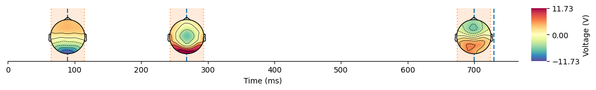

Quickstart
==========

For this documentation we first download some sample data (depending on
your internet connection this can take some time).

.. code:: ipython3

    import os
    import requests
    import numpy as np
    import xarray as xr
    import hmp
    from mne.io import read_info
    
    # Declaring path where the EEG data will be stored (here also the repo where it will be downloaded)
    epoch_data_path = os.path.join('..', 'tutorials' ,'sample_data', 'eeg')
    os.makedirs(epoch_data_path, exist_ok=True)
    
    # URLs of the first 4 participants in the SAT experiment of the 2024 HMP paper, navigate the osf folder and adapt those if you want to do this tutorial on other data (e.g. P3, N2pc)
    file_urls = [
        "https://osf.io/download/67cffa85f67af67e7a92f0a6/",
        "https://osf.io/download/67cffa85f67af67e7a92f0a8/",
        "https://osf.io/download/67cffa85f67af67e7a92f0aa/",
        "https://osf.io/download/67cffa85f67af67e7a92f0ac/",
        "https://osf.io/download/67cffa85f67af67e7a92f0ae/"
    ]
    
    # Download and save each file if not already in folder
    for i, url in enumerate(file_urls, start=1):
        file_path = os.path.join(epoch_data_path, f'participant{i}_epo.fif')
        if not os.path.exists(file_path):
            response = requests.get(url)
            with open(file_path, 'wb') as f:
                f.write(response.content)

We then load the data and turn into an hmp-friendly data format

.. code:: ipython3

    subj_files = [os.path.join(epoch_data_path, f) for f in os.listdir(epoch_data_path) if f.endswith('.fif')]  # Create a list of files with full paths
    subj_names = [os.path.splitext(f)[0] for f in os.listdir(epoch_data_path) if f.endswith('.fif')]  # Extract subject names based on file names
    
    # Recovering channel information (assuming the same for all participant)
    info = read_info(subj_files[0], verbose=False)
    
    epoch_data = hmp.io.read_mne_data(subj_files, epoched=True, sfreq=100, #downsampling to 100Hz for speed and RAM
                                lower_limit_rt=0.2, upper_limit_rt=2, # Taking all RTs between 200 and 2000 ms
                                rt_col = 'RT', scale = 1000, #In this case the rts are contained in the dataframe column "RT" and is in milliseconds, thus we adapt 
                                offset_after_resp=0.025, #We add 25ms after the response to avoid edge effects of component close to the RT
                                verbose=False, subj_idx=subj_names)#Turning verbose off for the documentation but it is recommended to leave it on as some output from MNE might be useful
    
    print(epoch_data)

.. parsed-literal::

    Processing participant ../Later_tutorials/sample_data/eeg/participant3_epo.fif's epoched eeg
    177 trials were retained for participant ../Later_tutorials/sample_data/eeg/participant3_epo.fif
    Processing participant ../Later_tutorials/sample_data/eeg/participant4_epo.fif's epoched eeg
    159 trials were retained for participant ../Later_tutorials/sample_data/eeg/participant4_epo.fif
    Processing participant ../Later_tutorials/sample_data/eeg/participant5_epo.fif's epoched eeg
    183 trials were retained for participant ../Later_tutorials/sample_data/eeg/participant5_epo.fif
    Processing participant ../Later_tutorials/sample_data/eeg/participant1_epo.fif's epoched eeg
    187 trials were retained for participant ../Later_tutorials/sample_data/eeg/participant1_epo.fif
    Processing participant ../Later_tutorials/sample_data/eeg/participant2_epo.fif's epoched eeg
    193 trials were retained for participant ../Later_tutorials/sample_data/eeg/participant2_epo.fif
    <xarray.Dataset> Size: 47MB
    Dimensions:      (participant: 5, epoch: 200, channel: 30, sample: 196)
    Coordinates:
      * epoch        (epoch) int64 2kB 0 1 2 3 4 5 6 ... 193 194 195 196 197 198 199
      * channel      (channel) <U3 360B 'Fp1' 'Fp2' 'AFz' 'F7' ... 'CPz' 'CP2' 'CP6'
      * sample       (sample) int64 2kB 0 1 2 3 4 5 6 ... 190 191 192 193 194 195
        stim         (participant, epoch) float64 8kB 1.0 nan 1.0 ... 2.0 1.0 2.0
        resp         (participant, epoch) object 8kB 'resp_left' ... 'resp_right'
        RT           (participant, epoch) float64 8kB 907.0 nan ... 468.0 350.0
        cue          (participant, epoch) object 8kB 'AC' nan 'AC' ... 'SP' 'AC'
        movement     (participant, epoch) object 8kB 'stim_left' ... 'stim_right'
        trigger      (participant, epoch) object 8kB 'AC/stim_left/resp_left' ......
      * participant  (participant) <U16 320B 'participant3_epo' ... 'participant2...
    Data variables:
        data         (participant, epoch, channel, sample) float64 47MB -7.935 .....
    Attributes:
        sfreq:             100.0
        offset:            2
        lowpass:           35.0
        highpass:          1.0
        lower_limit_rt:    0.2
        upper_limit_rt:    2
        reject_threshold:  inf
        n_trials:          899

The HMP ``Preprocessing`` class preprocess the data, including channel
reduction for which we select 6 components here

.. code:: ipython3

    preprocessed = hmp.preprocessing.Preprocessing(epoch_data, n_comp=6, copy=True)
    print(preprocessed.data)

.. parsed-literal::

    <xarray.DataArray (component: 6, all_samples: 66488)> Size: 3MB
    array([[-0.36036205,  0.57888562,  1.21725504, ...,  1.25083388,
             1.07092758,  0.53504892],
           [-0.94076385, -1.3586513 , -0.98206407, ..., -2.03068662,
            -2.06783416, -2.41507121],
           [-0.21445958, -0.22564113,  0.10054504, ...,  0.28247938,
             0.38174341,  0.36401025],
           [ 0.54001391,  0.82784224,  0.26839439, ..., -1.14504943,
            -0.96566491, -1.00696907],
           [-0.28214729, -0.55487474, -1.88149412, ...,  0.52866326,
             0.29802638, -0.43698157],
           [ 1.8295513 ,  1.16636093, -0.45345889, ..., -1.56914346,
            -1.78597502, -0.48109045]], shape=(6, 66488))
    Coordinates:
        stim         (all_samples) float64 532kB 1.0 1.0 1.0 1.0 ... 2.0 2.0 2.0 2.0
        resp         (all_samples) object 532kB 'resp_left' ... 'resp_right'
        RT           (all_samples) float64 532kB 907.0 907.0 907.0 ... 350.0 350.0
        cue          (all_samples) object 532kB 'AC' 'AC' 'AC' ... 'AC' 'AC' 'AC'
        movement     (all_samples) object 532kB 'stim_left' ... 'stim_right'
        trigger      (all_samples) object 532kB 'AC/stim_left/resp_left' ... 'AC/...
      * component    (component) int64 48B 0 1 2 3 4 5
      * all_samples  (all_samples) object 532kB MultiIndex
      * participant  (all_samples) <U16 4MB 'participant3_epo' ... 'participant2_...
      * epoch        (all_samples) int64 532kB 0 0 0 0 0 0 ... 199 199 199 199 199
      * sample       (all_samples) int64 532kB 0 1 2 3 4 5 6 ... 31 32 33 34 35 36
    Attributes:
        sfreq:    100.0
        offset:   2

Finally we:

1. define the pattern we’re looking for

2. Cross-correlate it with the data

3. initialize the model with three events

4. And fit it on the data

.. code:: ipython3

    event_properties = hmp.patterns.HalfSine.create_expected(sfreq=epoch_data.sfreq)
    trial_data = hmp.trialdata.TrialData.from_preprocessed_data(preprocessed=preprocessed, pattern=event_properties.template)
    
    model = hmp.models.FixedEventModel(event_properties, n_events=3)
    likelihood, estimate = model.fit_transform(trial_data)

.. parsed-literal::

    Estimating 3 events model with 1 starting point(s)

And we can plot the average solution

.. code:: ipython3

    hmp.visu.plot_topo_timecourse(epoch_data, estimate, info, as_time=True,)

